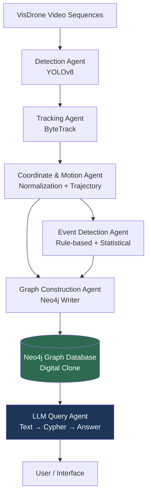
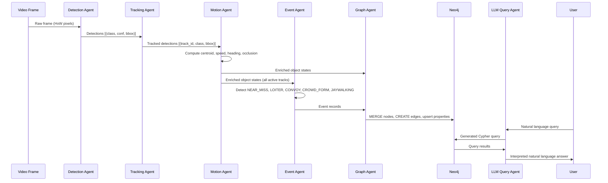
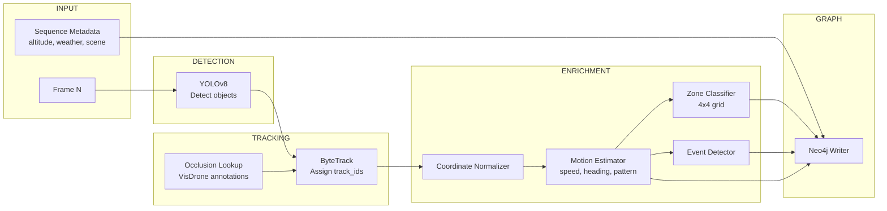
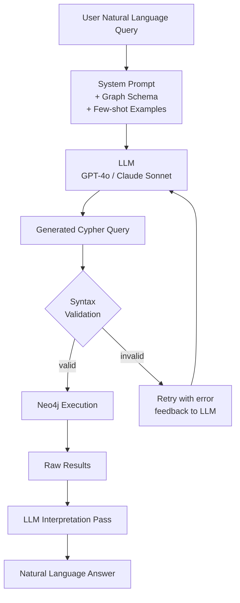
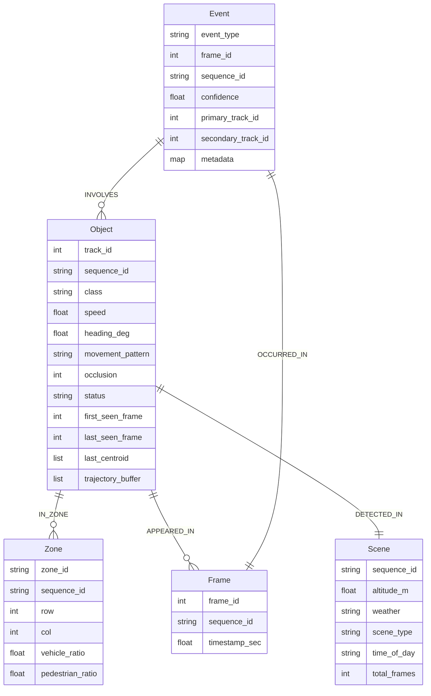

# AGENTS.md — Spatiotemporal Scene Graph Pipeline

> A simplified Palantir-style intelligence pipeline over drone video feeds.
> Detection → Tracking → Graph Construction → LLM Reasoning Interface.

---

## Table of Contents

1. [Project Overview](#1-project-overview)
2. [System Architecture](#2-system-architecture)
3. [Dataset](#3-dataset)
4. [Agent Definitions](#4-agent-definitions)
   - [Agent 1: Detection Agent](#agent-1-detection-agent)
   - [Agent 2: Tracking Agent](#agent-2-tracking-agent)
   - [Agent 3: Coordinate & Motion Agent](#agent-3-coordinate--motion-agent)
   - [Agent 4: Graph Construction Agent](#agent-4-graph-construction-agent)
   - [Agent 5: Event Detection Agent](#agent-5-event-detection-agent)
   - [Agent 6: LLM Query Agent](#agent-6-llm-query-agent)
5. [Graph Schema](#5-graph-schema)
6. [Neo4j Data Model](#6-neo4j-data-model)
7. [LLM Query Interface](#7-llm-query-interface)
8. [Feature Checklist](#8-feature-checklist)
9. [Directory Structure](#9-directory-structure)
10. [Environment & Dependencies](#10-environment--dependencies)
11. [Running the Pipeline](#11-running-the-pipeline)
12. [Evaluation Criteria](#12-evaluation-criteria)

---

## 1. Project Overview

This project builds a **spatiotemporal knowledge graph** over drone surveillance video (VisDrone dataset), and exposes it through a **natural language query interface** powered by an LLM.

The pipeline mimics what Palantir's Gotham/AIP does at a research scale:

- Raw drone footage is ingested and processed by a computer vision stack.
- Detected and tracked objects become **nodes** in a Neo4j graph database — analogous to Palantir's *Object Types* within their Ontology layer.
- Their spatial relationships, trajectories, and behavioral events become **typed, temporally-bounded edges** — analogous to Palantir's *Link Types*.
- Discrete behavioral events (NEAR_MISS, CONVOY, etc.) are **first-class nodes**, not just edge properties — analogous to Palantir's *Action Types*.
- An LLM performs **Semantic Grounding**: it interfaces exclusively with the graph schema (the "Ontology"), not raw pixel data, which eliminates hallucination over scene facts.
- The LLM translates natural language questions into Cypher queries using **Graph-Based Retrieval** (not plain RAG) — results are filtered through graph structure before being returned to the model.

> **Companion document:** All relationship construction rules, triad definitions, lifecycle management, and Cypher traversal patterns are specified in `relationships.md`. Agents must read both files.

> **Current implementation note:** This file describes the target ontology and
> reasoning surface. The graph currently persisted by the codebase is a thinner
> subset. Before updating prompts, graph logic, or query examples, also read
> `docs/graph_generation_shortcomings.md`.

**Five enrichment layers** are built on top of basic detection:

| Layer | What it adds |
|---|---|
| Trajectory & Motion Vectors | Speed, heading, movement pattern per object |
| Density Heatmap Zones | Grid-based zone nodes with temporal density counts |
| Interaction Events | Named discrete events: NEAR_MISS, LOITER, CONVOY, CROWD_FORM, JAYWALKING |
| Sequence-Level Context | VisDrone metadata: altitude, weather, scene type |
| Occlusion State | Per-detection reliability flag from VisDrone annotations |

**Two additional cross-cutting mechanisms** (drawn from real ISR pipeline architecture):

| Mechanism | What it adds |
|---|---|
| Entity Resolution | Post-processing pass that detects re-identified tracks (same physical object, different ByteTrack ID due to occlusion) and links them via `SAME_ENTITY_AS` relationships |
| VidSGG Triad Layer | Every relationship in the graph must be expressible as Subject → Predicate → Object; the Event Agent generates semantic triads, not just proximity flags |

---

## 2. System Architecture

### High-Level Pipeline



### Agent Interaction Detail



### Data Flow per Frame



---

## 3. Dataset

**Dataset:** VisDrone2019-DET  
**Source:** https://github.com/VisDrone/VisDrone-Dataset  
**Size:** ~2.3 GB (auto-downloadable via Ultralytics)

### Why VisDrone over xView / Airbus

| Criterion | VisDrone | xView | Airbus Ships |
|---|---|---|---|
| Has video sequences | ✅ 288 clips, 261K frames | ❌ Static images | ❌ Static images |
| Auto-download | ✅ | ❌ Manual NGA registration | ❌ Kaggle only |
| Pretrained YOLO support | ✅ Native YAML | ✅ But 20.7 GB | ❌ |
| Has occlusion annotations | ✅ | ❌ | ❌ |
| Temporal graph possible | ✅ | ❌ | ❌ |
| Scene diversity | 14 cities, urban/rural | Global satellite | Maritime only |

### Classes (10 total)

```
0: pedestrian    1: people        2: bicycle
3: car           4: van           5: truck
6: tricycle      7: awning-tricycle  8: bus  9: motor
```

### Sequence Metadata Available

Each VisDrone sequence provides:
- Drone altitude (meters)
- Weather condition (clear, overcast, foggy, rainy)
- Scene type (urban, suburban, rural)
- Time of day (daytime, nighttime)
- Frame rate and resolution

This metadata is stored as `Scene` nodes in the graph.

### Recommended Subset for Development

Start with **5–10 sequences** from Task 1 (image detection) and Task 4 (multi-object tracking). Pick sequences from the same city for spatial coherence. Suggested sequence IDs from VisDrone val split: `uav0000009`, `uav0000013`, `uav0000073`, `uav0000119`, `uav0000149`.

---

## 4. Agent Definitions

Each agent is a self-contained Python module with a defined input contract, output contract, and failure behavior.

---

### Agent 1: Detection Agent

**File:** `agents/detection_agent.py`  
**Responsibility:** Run YOLOv8 on each frame and return raw detections.

**Input:**
```python
{
  "frame": np.ndarray,          # HxWx3 BGR image
  "frame_id": int,
  "sequence_id": str
}
```

**Output:**
```python
[{
  "frame_id": int,
  "class_id": int,
  "class_name": str,
  "confidence": float,
  "bbox": [x1, y1, x2, y2],    # pixel coords
  "occlusion": int              # 0=none, 1=partial, 2=heavy (from annotation if available)
}]
```

**Implementation Notes:**
- Use `yolov8m.pt` fine-tuned on VisDrone (or fine-tune yourself for 20–30 epochs).
- Confidence threshold: `0.35` — VisDrone has many small objects, don't be too aggressive.
- NMS IoU threshold: `0.45`.
- For the occlusion field: if running on annotated val/test data, load from `.txt` annotation files directly. If running inference-only, set `occlusion=0` as default.

**Key parameters:**
```python
CONF_THRESHOLD = 0.35
IOU_THRESHOLD = 0.45
IMG_SIZE = 640
MODEL_PATH = "weights/yolov8m_visdrone.pt"
```

**Failure behavior:** If YOLO returns zero detections, emit an empty list. Do not crash. Log frame_id for diagnostic.

---

### Agent 2: Tracking Agent

**File:** `agents/tracking_agent.py`  
**Responsibility:** Assign persistent `track_id` to each detection across frames using ByteTrack.

**Input:** List of detection dicts from Agent 1 (single frame).

**Output:**
```python
[{
  "track_id": int,              # persistent across frames
  "frame_id": int,
  "class_id": int,
  "class_name": str,
  "confidence": float,
  "bbox": [x1, y1, x2, y2],
  "occlusion": int,
  "is_new": bool,               # True if first frame this track_id appears
  "is_lost": bool               # True if tracker marked this track as lost
}]
```

**Implementation Notes:**
- Use `ultralytics` built-in tracker: `model.track(source=..., tracker="bytetrack.yaml", persist=True)`.
- Alternatively, use the standalone `boxmot` library for more control.
- `track_id` is the canonical node identifier in Neo4j. Never reuse a `track_id` within a sequence.
- When a track is "lost" (object goes out of frame or occluded), mark `is_lost=True` but **do not delete the node** — keep it with a `status: "lost"` property.

**ByteTrack config (`bytetrack.yaml`):**
```yaml
tracker_type: bytetrack
track_high_thresh: 0.5
track_low_thresh: 0.1
new_track_thresh: 0.6
track_buffer: 30
match_thresh: 0.8
```

**Failure behavior:** If tracking library throws on a frame, fall back to treating each detection as a new untracked object (track_id = -1 * frame_id * detection_index). Log prominently.

---

### Agent 3: Coordinate & Motion Agent

**File:** `agents/motion_agent.py`  
**Responsibility:** Convert pixel bounding boxes to normalized spatial coordinates, compute motion vectors, classify movement patterns.

**Input:** List of tracked detection dicts (current frame) + history buffer of last N frames per track_id.

**Output:**
```python
[{
  "track_id": int,
  "frame_id": int,
  "class_name": str,
  "centroid_norm": [float, float],   # [x, y] in [0,1] range, origin top-left
  "bbox_norm": [x1, y1, x2, y2],    # normalized bbox
  "speed_px_per_frame": float,       # pixel displacement / frame (altitude-agnostic)
  "heading_deg": float,              # 0=right, 90=down, 180=left, 270=up
  "movement_pattern": str,           # "stationary" | "linear" | "erratic"
  "occlusion": int,
  "zone_id": str,                    # e.g., "cell_2_3" from 4x4 grid
  "trajectory_buffer": [[x,y], ...]  # last 30 centroids
}]
```

**Coordinate Normalization:**
```python
def normalize_bbox(bbox, frame_w, frame_h):
    x1, y1, x2, y2 = bbox
    return [x1/frame_w, y1/frame_h, x2/frame_w, y2/frame_h]

def get_centroid(bbox_norm):
    x1, y1, x2, y2 = bbox_norm
    return [(x1+x2)/2, (y1+y2)/2]
```

**Speed & Heading:**
```python
def compute_motion(centroid_history: list[tuple]) -> dict:
    if len(centroid_history) < 2:
        return {"speed": 0.0, "heading": 0.0}
    dx = centroid_history[-1][0] - centroid_history[-2][0]
    dy = centroid_history[-1][1] - centroid_history[-2][1]
    speed = (dx**2 + dy**2) ** 0.5
    heading = math.degrees(math.atan2(dy, dx)) % 360
    return {"speed": speed, "heading": heading}
```

**Movement Pattern Classification:**
```python
def classify_movement(speed_history: list[float], heading_history: list[float]) -> str:
    avg_speed = sum(speed_history) / len(speed_history)
    heading_variance = variance(heading_history)

    if avg_speed < STATIONARY_THRESH:          # e.g., 0.003 normalized units/frame
        return "stationary"
    elif heading_variance > ERRATIC_THRESH:    # e.g., 800 degrees^2
        return "erratic"
    else:
        return "linear"
```

**Zone Assignment (4×4 grid):**
```python
def assign_zone(centroid_norm: list[float], grid_size=4) -> str:
    col = min(int(centroid_norm[0] * grid_size), grid_size - 1)
    row = min(int(centroid_norm[1] * grid_size), grid_size - 1)
    return f"cell_{row}_{col}"
```

**Failure behavior:** If history buffer has < 2 frames, set speed=0, heading=0, pattern="stationary". Always emit a result.

---

### Agent 4: Graph Construction Agent

**File:** `agents/graph_agent.py`  
**Responsibility:** Write enriched object states and events into Neo4j. Manages node creation, property updates, and edge creation.

**Input:** Enriched object states from Agent 3 + events from Agent 5 + sequence metadata.

**Neo4j Write Operations (per frame):**

```python
# MERGE object node (create or update)
MERGE (o:Object {track_id: $track_id, sequence_id: $seq_id})
SET o.class = $class_name,
    o.last_seen_frame = $frame_id,
    o.last_centroid = $centroid_norm,
    o.speed = $speed,
    o.heading = $heading,
    o.movement_pattern = $movement_pattern,
    o.occlusion = $occlusion,
    o.status = $status

# MERGE zone node
MERGE (z:Zone {zone_id: $zone_id, sequence_id: $seq_id})

# Link object to zone
MERGE (o)-[r:IN_ZONE]->(z)
SET r.frame_id = $frame_id,
    r.density_contribution = 1

# Link object to frame
MERGE (f:Frame {frame_id: $frame_id, sequence_id: $seq_id})
MERGE (o)-[:APPEARED_IN {centroid: $centroid_norm}]->(f)
```

**Current implementation reality:** the code currently persists `Object`,
`Frame`, `Zone`, `Scene`, and `Event` nodes plus `IN_ZONE`, `APPEARED_IN`,
`INVOLVES`, `OCCURRED_IN`, `SAME_ENTITY_AS`, and `COEXISTS_WITH`
relationships. It does not yet materialize the richer semantic and
hierarchical relationship set described elsewhere in this file during normal
ingestion.

**Batching:** Accumulate writes across 30 frames (1 second at 30fps) and flush as a single transaction. Do not write per-frame individually — Neo4j will buckle.

**Connection config:**
```python
NEO4J_URI = "bolt://localhost:7687"
NEO4J_USER = "neo4j"
NEO4J_PASSWORD = "your_password"
BATCH_SIZE = 30  # frames
```

**Failure behavior:** On write failure, buffer to a local `.jsonl` file and retry on next batch. Never drop data silently.

---

### Agent 5: Event Detection Agent

**File:** `agents/event_agent.py`  
**Responsibility:** Analyze the current state of all active tracks and emit discrete named events. This is the intelligence layer — the thing that makes the graph semantically useful.

This agent implements a simplified **Video Scene Graph Generation (VidSGG)** layer. Every event it emits ultimately produces a **Subject → Predicate → Object** triad in the graph — not just a flag or counter. The Event Agent reasons about *what is happening between objects*, not just *where objects are*. See `relationships.md` Section 3 for the complete list of valid triads and Section 9 for relationship lifecycle rules (MIN_FRAMES, GRACE_FRAMES, state machines).

**Internal state the agent must maintain across frames (not re-initialized per frame):**
- `convoy_candidate_buffer: dict[(tid_A, tid_B), int]` — consecutive frame count per pair
- `zone_residence_counter: dict[tid, dict[zone_id, int]]` — frames per zone per track
- `near_miss_last_frame: dict[(tid_A, tid_B), int]` — last frame a pair triggered NEAR_MISS (dedup)
- `follow_candidate_buffer: dict[(tid_A, tid_B), int]` — consecutive frame count for FOLLOWING
- `zone_density_history: dict[zone_id, list[{frame, count}]]` — for CROWD_FORM detection
- `zone_class_stats: dict[zone_id, {vehicle_ratio, pedestrian_ratio}]` — updated each frame

**Input:** Full dict of `{track_id: enriched_state}` for all currently active tracks in this frame.

**Output:**
```python
[{
  "event_type": str,            # see events below
  "frame_id": int,
  "sequence_id": str,
  "primary_track_id": int,
  "secondary_track_id": int,    # None if unary event
  "confidence": float,
  "metadata": dict              # event-specific fields
}]
```

**Events Defined:**

#### NEAR_MISS
Two objects of different class groups (pedestrian/cyclist vs. vehicle) come within a proximity threshold while both moving above a speed threshold.

```python
NEAR_MISS_DISTANCE_THRESH = 0.05     # normalized units (~5% of frame width)
NEAR_MISS_MIN_SPEED = 0.004          # must be moving

def detect_near_miss(tracks: dict) -> list[Event]:
    events = []
    pedestrian_classes = {"pedestrian", "people", "bicycle", "motor", "tricycle"}
    vehicle_classes = {"car", "van", "truck", "bus", "awning-tricycle"}

    peds = [t for t in tracks.values() if t["class_name"] in pedestrian_classes]
    vehs = [t for t in tracks.values() if t["class_name"] in vehicle_classes]

    for p in peds:
        for v in vehs:
            dist = euclidean(p["centroid_norm"], v["centroid_norm"])
            if dist < NEAR_MISS_DISTANCE_THRESH:
                if p["speed"] > NEAR_MISS_MIN_SPEED or v["speed"] > NEAR_MISS_MIN_SPEED:
                    events.append(Event(
                        event_type="NEAR_MISS",
                        primary=p["track_id"],
                        secondary=v["track_id"],
                        metadata={"distance": dist}
                    ))
    return events
```

#### LOITER
A pedestrian or unclassified person remains stationary or near-stationary in the same zone for more than T seconds.

```python
LOITER_TIME_THRESH = 90              # frames (~3 seconds at 30fps)
LOITER_CLASSES = {"pedestrian", "people"}

def detect_loiter(tracks: dict, zone_residence_counter: dict) -> list[Event]:
    # zone_residence_counter[track_id] = frames_in_current_zone
    events = []
    for tid, t in tracks.items():
        if t["class_name"] in LOITER_CLASSES and t["movement_pattern"] == "stationary":
            zone_residence_counter[tid] = zone_residence_counter.get(tid, 0) + 1
            if zone_residence_counter[tid] == LOITER_TIME_THRESH:
                events.append(Event("LOITER", primary=tid, metadata={"zone": t["zone_id"]}))
    return events
```

#### CONVOY
Two vehicles of the same class maintain consistent relative distance and heading over N frames.

```python
CONVOY_DISTANCE_RANGE = (0.03, 0.12)    # not too close, not too far
CONVOY_HEADING_DIFF_MAX = 20            # degrees
CONVOY_PERSISTENCE_FRAMES = 45          # must hold for 1.5 seconds

def detect_convoy(tracks: dict, convoy_candidate_counter: dict) -> list[Event]:
    ...  # pairwise check for vehicle pairs matching heading + distance criteria
```

#### CROWD_FORM
A zone's pedestrian density crosses a threshold within a short time window — crowd forming.

```python
CROWD_DENSITY_THRESH = 8            # pedestrians in a single zone cell
CROWD_TIME_WINDOW = 60              # frames

def detect_crowd_form(zone_density_history: dict, frame_id: int) -> list[Event]:
    events = []
    for zone_id, history in zone_density_history.items():
        recent = [h for h in history if frame_id - h["frame"] < CROWD_TIME_WINDOW]
        current_density = recent[-1]["count"] if recent else 0
        past_density = recent[0]["count"] if recent else 0
        if current_density >= CROWD_DENSITY_THRESH and current_density > past_density * 2:
            events.append(Event("CROWD_FORM", metadata={"zone": zone_id, "density": current_density}))
    return events
```

#### JAYWALKING
A pedestrian centroid is detected within a zone that is statistically dominated by vehicles (vehicle_ratio > 0.8 in that zone).

```python
def detect_jaywalking(tracks: dict, zone_class_stats: dict) -> list[Event]:
    events = []
    for tid, t in tracks.items():
        if t["class_name"] in {"pedestrian", "people"}:
            zone = t["zone_id"]
            stats = zone_class_stats.get(zone, {})
            vehicle_ratio = stats.get("vehicle_ratio", 0)
            if vehicle_ratio > 0.8:
                events.append(Event("JAYWALKING", primary=tid, metadata={"zone": zone, "vehicle_ratio": vehicle_ratio}))
    return events
```

---

### Agent 6: LLM Query Agent

**File:** `agents/llm_agent.py`  
**Responsibility:** Accept natural language queries, generate Cypher, execute against Neo4j, and return interpreted answers.

**Architecture:**



**System Prompt Template:**
```
You are a Cypher query generator for a spatiotemporal scene graph database (Neo4j).
The graph is a digital twin of drone surveillance scenes from the VisDrone dataset.
You reason ONLY over the schema defined below — do not invent node labels, relationship
types, or property names that are not listed here. This is your ground truth.

CLASS TAXONOMY:
- VulnerableRoadUser: pedestrian, people, bicycle, motor, tricycle, awning-tricycle
- MotorVehicle: car, van, truck, bus
  Use BELONGS_TO_CLASS traversal for class-group queries, not string matching.

NODE TYPES:
- Object {track_id, sequence_id, class, speed, heading, movement_pattern, occlusion,
          status, first_seen_frame, last_seen_frame, last_centroid, canonical_id}
- Zone {zone_id, sequence_id, vehicle_ratio, pedestrian_ratio, last_density}
- Frame {frame_id, sequence_id, timestamp_sec}
- Scene {sequence_id, altitude_m, weather, scene_type, time_of_day, total_frames}
- Event {event_type, frame_id, sequence_id, confidence, primary_track_id,
         secondary_track_id, metadata}
- ObjectClass {name, class_group}   [taxonomy nodes, fixed set]

RELATIONSHIP TYPES (with key properties):
- (Object)-[:IN_ZONE {frame_id, duration_frames, is_active}]->(Zone)
- (Object)-[:APPEARED_IN {centroid, confidence, occlusion, speed, heading}]->(Frame)
- (Object)-[:DETECTED_IN]->(Scene)
- (Object)-[:BELONGS_TO_CLASS]->(ObjectClass)
- (Object)-[:NEAR {distance, frame_id, both_moving, is_active}]->(Object)
- (Object)-[:APPROACHING {closing_speed, angle_diff, is_active}]->(Object)
- (Object)-[:NEAR_MISS {distance, severity, frame_id}]->(Object)
- (Object)-[:CONVOY_WITH {avg_distance, duration_frames, is_active}]->(Object)
- (Object)-[:FOLLOWING {avg_trail_distance, is_active}]->(Object)
- (Object)-[:LOITERING_IN {duration_frames, is_active}]->(Zone)
- (Object)-[:JAYWALKING_IN {vehicle_ratio, frame_id}]->(Zone)
- (Object)-[:SAME_ENTITY_AS {confidence, method}]->(Object)
- (Object)-[:COEXISTS_WITH {overlap_frames, min_distance_ever}]->(Object)
- (Event)-[:INVOLVES {role}]->(Object)   [role: "primary" | "secondary"]
- (Event)-[:OCCURRED_IN]->(Frame)
- (Frame)-[:PRECEDES]->(Frame)

RULES:
1. Always filter by sequence_id unless the user explicitly asks for cross-sequence queries.
2. Use OPTIONAL MATCH for relationships that may not exist on all matched nodes.
3. For class-group queries ("all vehicles", "vulnerable road users") use BELONGS_TO_CLASS.
4. When asking about object history, traverse APPEARED_IN ordered by frame_id.
5. For re-identified objects, use canonical_id to group tracks.
6. is_active=true means the condition currently holds; is_active=false is historical.
7. Return human-readable fields. Do not return internal node IDs.
8. LIMIT 50 by default unless the user asks for all results.
9. NEAR_MISS severity: "critical" means distance < 0.03, "warning" means 0.03–0.05.

Generate ONLY valid Cypher. No explanation, no markdown, no code fences.
```

**Important — Semantic Grounding principle:** The LLM must never answer from its own parametric knowledge about the scene. If the graph has no data supporting a claim, the answer must say so. The system prompt should end with: `If the query result is empty, say "No data found in the graph for this query." Never infer or assume scene facts beyond what the graph returns.`

**Few-shot examples to include in prompt** (use the 10 traversal patterns from `relationships.md` Section 12 verbatim as few-shot examples — they cover all major query categories).

**Retry Logic:**
```python
MAX_RETRIES = 3

async def query(nl_query: str, sequence_id: str) -> str:
    cypher = None
    for attempt in range(MAX_RETRIES):
        cypher = await llm_generate_cypher(nl_query, error=last_error)
        valid, last_error = validate_cypher_syntax(cypher)
        if valid:
            break
    if not valid:
        return "Could not generate a valid query. Please rephrase."
    results = neo4j_run(cypher)
    answer = await llm_interpret(nl_query, results)
    return answer
```

---

## 5. Graph Schema

### Node Types



### Relationship Types

| Relationship | From | To | Key Properties |
|---|---|---|---|
| `IN_ZONE` | Object | Zone | frame_id |
| `APPEARED_IN` | Object | Frame | centroid, bbox_norm |
| `DETECTED_IN` | Object | Scene | — |
| `INVOLVES` | Event | Object | role: "primary"/"secondary" |
| `OCCURRED_IN` | Event | Frame | — |
| `NEAR_MISS` | Object | Object | distance, frame_id |
| `CONVOY_WITH` | Object | Object | duration_frames, avg_distance |

---

## 6. Neo4j Data Model

### Index Setup (run once on startup)

```cypher
CREATE INDEX object_track IF NOT EXISTS FOR (o:Object) ON (o.track_id, o.sequence_id);
CREATE INDEX object_class IF NOT EXISTS FOR (o:Object) ON (o.class);
CREATE INDEX event_type IF NOT EXISTS FOR (e:Event) ON (e.event_type, e.sequence_id);
CREATE INDEX zone_id IF NOT EXISTS FOR (z:Zone) ON (z.zone_id, z.sequence_id);
CREATE INDEX frame_id IF NOT EXISTS FOR (f:Frame) ON (f.frame_id, f.sequence_id);
CREATE INDEX scene_seq IF NOT EXISTS FOR (s:Scene) ON (s.sequence_id);
```

### Zone Density Update (per batch)

```cypher
// Update zone density counters
MATCH (z:Zone {zone_id: $zone_id, sequence_id: $seq_id})
SET z.last_density = $density,
    z.vehicle_ratio = $vehicle_ratio,
    z.pedestrian_ratio = $pedestrian_ratio,
    z.updated_at_frame = $frame_id
```

### Event Write

```cypher
CREATE (e:Event {
    event_type: $event_type,
    frame_id: $frame_id,
    sequence_id: $seq_id,
    confidence: $confidence,
    primary_track_id: $primary_tid,
    secondary_track_id: $secondary_tid,
    metadata: $metadata
})
WITH e
MATCH (o1:Object {track_id: $primary_tid, sequence_id: $seq_id})
MERGE (e)-[:INVOLVES {role: 'primary'}]->(o1)
WITH e
MATCH (f:Frame {frame_id: $frame_id, sequence_id: $seq_id})
MERGE (e)-[:OCCURRED_IN]->(f)
```

---

## 7. LLM Query Interface

**Important:** the query interface must be grounded in the graph that actually
exists in Neo4j, not just the target ontology in this document. Use
`docs/graph_generation_shortcomings.md` as the source of truth for current
implementation limits.

### Supported Query Categories

**Category 1 — Counting & Inventory**
```
"How many unique vehicles appeared in sequence uav0000009?"
"What is the pedestrian-to-vehicle ratio at frame 450?"
"Which object class dominates this scene?"
```

**Category 2 — Spatial Queries**
```
"Which pedestrians were within close range of a moving truck at any point?"
"What objects are clustered in zone cell_2_3 right now?"
"Are there bicycles near any bus stop zones?"
```

**Category 3 — Temporal / Behavioral**
```
"Which vehicles have been stationary for more than 60 frames?"
"Which tracked objects entered and exited the frame more than once?"
"Show me all objects that were near track_id 47 within 10 frames of each other."
"Are any pedestrians moving against the dominant traffic flow direction?"
```

**Category 4 — Event Queries**
```
"Show me all near-miss events in the last sequence."
"Which pedestrians were flagged for loitering and in which zones?"
"Are there convoy formations involving trucks?"
"Did any crowd formations occur in foggy weather conditions?"
```

**Category 5 — Cross-Sequence / Analytical**
```
"Compare near-miss rates between foggy and clear weather sequences."
"Which zones consistently have high vehicle density across multiple sequences?"
"Are erratic movers more common at low drone altitudes?"
"Which sequences had the most JAYWALKING events?"
```

---

## 8. Feature Checklist

Use this to track implementation progress:

### Core Pipeline
- [ ] YOLOv8 fine-tuned on VisDrone (or loaded from community weights)
- [ ] ByteTrack integration with persistent track_id
- [ ] Bounding box → normalized centroid conversion
- [ ] Speed and heading computation from centroid history
- [ ] Movement pattern classification (stationary / linear / erratic)

### Graph Layer
- [ ] Neo4j connection + index setup
- [ ] Object node MERGE + property update
- [ ] Frame node creation
- [ ] Scene node from VisDrone metadata
- [ ] Zone node from 4×4 grid
- [ ] IN_ZONE edge per frame
- [ ] APPEARED_IN edge per frame
- [ ] DETECTED_IN edge to scene
- [ ] Batch write (30-frame buffer)

### Enrichment Layer 1 — Trajectory & Motion
- [ ] Trajectory buffer (last 30 centroids) stored per track
- [ ] Speed history stored on Object node
- [ ] Heading history stored on Object node
- [ ] Movement pattern label on Object node

### Enrichment Layer 2 — Density Zones
- [ ] Zone density counter per frame
- [ ] vehicle_ratio and pedestrian_ratio on Zone node
- [ ] Density history stored (for trend queries)

### Enrichment Layer 3 — Interaction Events
- [ ] NEAR_MISS detection + Event node + INVOLVES edges
- [ ] LOITER detection + Event node
- [ ] CONVOY detection + CONVOY_WITH edge between Object nodes
- [ ] CROWD_FORM detection + Event node
- [ ] JAYWALKING detection + Event node

### Enrichment Layer 4 — Sequence Context
- [ ] VisDrone metadata parser (altitude, weather, scene_type, time_of_day)
- [ ] Scene node creation per sequence
- [ ] Object → Scene DETECTED_IN edges

### Enrichment Layer 5 — Occlusion State
- [ ] Occlusion field parsed from VisDrone annotation files
- [ ] Stored as property on Object node (per frame snapshot)
- [ ] High-occlusion frames flagged in trajectory buffer

### LLM Query Interface
- [ ] System prompt with schema + few-shot examples
- [ ] Cypher syntax validation layer
- [ ] Retry logic (up to 3 attempts)
- [ ] Results interpretation pass
- [ ] CLI interface for queries
- [ ] Optional: Streamlit/Gradio web UI

---

## 9. Directory Structure

```
spatiotemporal-scene-graph/
│
├── AGENTS.md                        # this file
├── relationships.md                 # relationship schema, triads, lifecycle rules
├── README.md
├── requirements.txt
├── .env                             # NEO4J_URI, NEO4J_PASSWORD, OPENAI_API_KEY
│
├── agents/
│   ├── __init__.py
│   ├── detection_agent.py           # Agent 1: YOLOv8 inference
│   ├── tracking_agent.py            # Agent 2: ByteTrack
│   ├── motion_agent.py              # Agent 3: Coord normalization + motion
│   ├── graph_agent.py               # Agent 4: Neo4j writer (enforces relationships.md rules)
│   ├── event_agent.py               # Agent 5: VidSGG-style event detection
│   ├── llm_agent.py                 # Agent 6: Text → Cypher → Answer
│   └── entity_resolution_agent.py  # Agent 7: Post-processing re-ID + COEXISTS_WITH
│
├── pipeline/
│   ├── runner.py                    # Orchestrates agents per frame/sequence
│   ├── batch_writer.py              # 30-frame buffer + flush logic
│   ├── sequence_loader.py           # VisDrone dataset loading utilities
│   └── post_processor.py           # Calls Agent 7 after sequence completion
│
├── graph/
│   ├── schema.py                    # Index creation, constraint setup, ObjectClass taxonomy init
│   ├── queries.py                   # Reusable Cypher templates (from relationships.md Section 12)
│   ├── validator.py                 # Relationship validation rules (from relationships.md Section 10)
│   └── neo4j_client.py              # Connection wrapper
│
├── data/
│   ├── visdrone/                    # Auto-downloaded dataset
│   │   ├── images/
│   │   └── labels/
│   └── sequences.json               # Metadata for selected sequences
│
├── weights/
│   └── yolov8m_visdrone.pt          # Fine-tuned model weights
│
├── configs/
│   ├── bytetrack.yaml
│   ├── detection.yaml               # Thresholds, model path
│   ├── event.yaml                   # All event detection thresholds (single source of truth)
│   ├── relationships.yaml           # Allowed relationship types (Graph Agent reads this)
│   └── llm.yaml                     # Model, temperature, retry count
│
├── prompts/
│   ├── system_prompt.txt            # LLM system prompt (full schema from relationships.md)
│   └── few_shot_examples.json       # 10 examples from relationships.md Section 12
│
├── logs/
│   ├── reid_ambiguous.jsonl         # Ambiguous entity resolution cases
│   ├── validation_failures.jsonl    # Relationship validation violations
│   └── llm_zero_results.jsonl       # NL queries returning empty graph results
│
├── notebooks/
│   ├── 01_dataset_exploration.ipynb
│   ├── 02_detection_baseline.ipynb
│   ├── 03_tracking_demo.ipynb
│   ├── 04_graph_inspection.ipynb
│   ├── 05_entity_resolution_demo.ipynb
│   └── 06_llm_query_demo.ipynb
│
├── eval/
│   ├── detection_metrics.py         # mAP on VisDrone val
│   ├── tracking_metrics.py          # MOTA, MOTP via TrackEval
│   ├── cypher_accuracy.py           # LLM Cypher correctness eval
│   └── event_precision.py           # Event detection precision/recall + threshold calibration
│
└── ui/
    └── app.py                       # Streamlit interface (optional)
```

---

## 10. Environment & Dependencies

```txt
# requirements.txt

# CV & Detection
ultralytics>=8.0.0
torch>=2.0.0
torchvision>=0.15.0
opencv-python>=4.8.0

# Tracking
boxmot>=10.0.0        # includes ByteTrack, BoTSORT

# Graph
neo4j>=5.0.0

# LLM
openai>=1.0.0         # or anthropic>=0.20.0

# Scientific
numpy>=1.24.0
scipy>=1.10.0
pandas>=2.0.0

# Utilities
python-dotenv>=1.0.0
tqdm>=4.65.0
pyyaml>=6.0

# UI (optional)
streamlit>=1.30.0
gradio>=4.0.0
```

```bash
# .env
NEO4J_URI=bolt://localhost:7687
NEO4J_USER=neo4j
NEO4J_PASSWORD=your_password
OPENAI_API_KEY=sk-...
# or
ANTHROPIC_API_KEY=sk-ant-...
SEQUENCE_IDS=uav0000009,uav0000013,uav0000073
```

---

## 11. Running the Pipeline

### Step 1: Setup

```bash
git clone <repo>
cd spatiotemporal-scene-graph
pip install -r requirements.txt
cp .env.example .env  # fill in keys

# Start Neo4j (Docker recommended)
docker run -d \
  --name neo4j \
  -p 7474:7474 -p 7687:7687 \
  -e NEO4J_AUTH=neo4j/your_password \
  neo4j:5
```

### Step 2: Download Dataset

```python
from ultralytics.utils.downloads import download
# VisDrone auto-downloads via Ultralytics when you train or specify the YAML
# Or manually:
python pipeline/sequence_loader.py --download
```

### Step 3: Initialize Graph Schema

```python
python -c "from graph.schema import init_schema; init_schema()"
```

### Step 4: Run the Pipeline

```bash
# Process a single sequence
python pipeline/runner.py --sequence uav0000009

# Process all configured sequences
python pipeline/runner.py --all

# With visualization (draws bounding boxes + track IDs on video)
python pipeline/runner.py --sequence uav0000009 --visualize
```

### Step 5: Query the Graph

```bash
# CLI query interface
python agents/llm_agent.py --sequence uav0000009

# Interactive prompt:
> Which vehicles were stationary for more than 60 frames?
> Were there any near-miss events in this sequence?
> Show me zones with the highest pedestrian density.
```

### Step 6: Evaluate

```bash
python eval/detection_metrics.py    # mAP on val split
python eval/tracking_metrics.py     # MOTA / MOTP
python eval/cypher_accuracy.py      # % of NL queries generating valid+correct Cypher
python eval/event_precision.py      # Precision/recall on manually labeled events
```

---

## 12. Evaluation Criteria

### Detection (Agent 1)
| Metric | Target |
|---|---|
| mAP@0.5 | > 0.35 on VisDrone val (small objects are hard) |
| mAP@0.5:0.95 | > 0.20 |
| Inference speed | > 15 FPS on GPU |

### Tracking (Agent 2)
| Metric | Target |
|---|---|
| MOTA | > 0.40 |
| MOTP | > 0.65 |
| ID Switches | < 5% of total tracks |

### Graph Quality
| Metric | Target |
|---|---|
| Node coverage | > 95% of tracked objects have complete property sets |
| Edge coverage | All IN_ZONE + APPEARED_IN edges written |
| Write latency | < 200ms per 30-frame batch |

### Entity Resolution & Post-Processing (Agent 7)
- [ ] Re-ID candidate detection (5-condition check per track pair)
- [ ] Confidence scoring for re-ID decisions
- [ ] `SAME_ENTITY_AS` relationship creation
- [ ] `canonical_id` property update on Object nodes
- [ ] `COEXISTS_WITH` relationship batch creation
- [ ] Ambiguous re-ID logging to `logs/reid_ambiguous.jsonl`

### VidSGG Triad Compliance
- [ ] All Event Agent outputs expressible as Subject → Predicate → Object
- [ ] `NEAR` (raw spatial) and `NEAR_MISS` (semantic) both written independently
- [ ] `LOITERING_IN` writes to Zone node (not stored as Object property)
- [ ] `JAYWALKING_IN` writes to Zone node
- [ ] `CROWD_MEMBER_OF` links individual Objects to Event node
- [ ] Relationship validation rules from `relationships.md` Section 10 enforced in Graph Agent

### LLM Query Agent
| Metric | Target |
|---|---|
| Cypher syntax validity | > 90% of queries produce valid Cypher on first attempt |
| Semantic correctness | > 75% of queries return expected results (manual eval on 20 test queries) |
| Retry rate | < 25% of queries need a retry |

### Event Detection (manual spot-check on 3 sequences)
| Event | Precision Target |
|---|---|
| NEAR_MISS | > 0.70 |
| LOITER | > 0.80 |
| CONVOY | > 0.65 |
| CROWD_FORM | > 0.75 |
| JAYWALKING | > 0.60 |

---

## Agent 7: Entity Resolution Agent (Post-Processing)

**File:** `agents/entity_resolution_agent.py`  
**Responsibility:** Run after a sequence is fully ingested. Detect ByteTrack identity splits (same physical object assigned multiple `track_id` values due to occlusion) and link them with `SAME_ENTITY_AS` relationships. Also computes `COEXISTS_WITH` relationships between all overlapping tracks.

**When to run:** Called by `pipeline/runner.py` after the final frame of each sequence is processed. Not real-time — this is a batch post-processing step.

**Inputs:** All Object nodes for the current `sequence_id` (read from Neo4j).

**Algorithm:**
1. Load all Object nodes for the sequence, sorted by `first_seen_frame`.
2. For each pair (A, B) where `A.last_seen_frame < B.first_seen_frame`:
   - Check all five re-ID conditions defined in `relationships.md` Section 8.
   - If all pass, compute a confidence score (weighted average of normalized condition strengths).
   - If confidence ≥ 0.70: create `SAME_ENTITY_AS` relationship + set `canonical_id` on both.
3. For all pairs (A, B) with overlapping lifespans: create `COEXISTS_WITH` with overlap stats.

**Confidence scoring:**
```
spatial_score   = 1 - (distance / REID_SPATIAL_THRESH)       weight: 0.35
temporal_score  = 1 - (gap / REID_TEMPORAL_GAP)              weight: 0.25
heading_score   = 1 - (angle_diff / 45.0)                    weight: 0.20
class_score     = 1.0 if same class else 0.0                  weight: 0.20

confidence = weighted_sum(scores)
```

**Output written to Neo4j:**
- `SAME_ENTITY_AS` relationships (see `relationships.md` Section 8.4)
- `canonical_id` property updated on Object nodes
- `COEXISTS_WITH` relationships (see `relationships.md` Section 5.3)

**Failure behavior:** If any pair creates ambiguous re-ID (object A could be B or C with similar confidence), create no `SAME_ENTITY_AS` for that ambiguous set. Log all ambiguous cases to `logs/reid_ambiguous.jsonl` for manual review.

---

## Notes & Known Limitations

1. **No ground plane recovery** — All spatial coordinates are 2D image projections. Speed and distance are in normalized pixel units, not meters. This is an intentional simplification. For real-world meter units, drone altitude + camera intrinsics would be required (see the georegistration math in the companion research document). The system prompt for the LLM must state that distances are in "normalized frame units" to prevent misinterpretation.

2. **Track ID fragmentation** — ByteTrack loses tracks during heavy occlusion. The Entity Resolution Agent (Agent 7) addresses this post-hoc via `SAME_ENTITY_AS`. For better real-time continuity, replace ByteTrack with BoTSORT + a ReID model (OSNet or FastReID) — this is a drop-in swap in `configs/bytetrack.yaml`.

3. **Event false positives** — Rule-based event detection is threshold-sensitive. All thresholds live in `configs/event.yaml`. Calibrate on a held-out validation sequence before running on test data. The `eval/event_precision.py` script automates this calibration loop.

4. **LLM semantic hallucination** — The updated system prompt in Agent 6 enforces semantic grounding: the LLM is explicitly told it cannot reference schema elements not in the prompt. Syntax validation catches structural errors; add a property-existence check (`EXPLAIN` or dry-run MATCH) for semantic validation. Log all zero-result queries — they may indicate property name drift.

5. **Relationship schema drift** — If a new relationship type is needed, it must be added to `relationships.md` Section 3 first. The Graph Agent should read the allowed relationship list from a config, not have it hardcoded, so additions don't require code changes.

6. **Scalability** — At 30fps, a 60-second clip generates ~1800 frames × N objects. For 10 sequences, expect ~500K–2M nodes. Neo4j handles this with the indexes defined in Section 6. Enable **GDS (Graph Data Science)** library if adding community detection (crowd clustering) or shortest-path queries.
