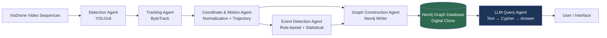
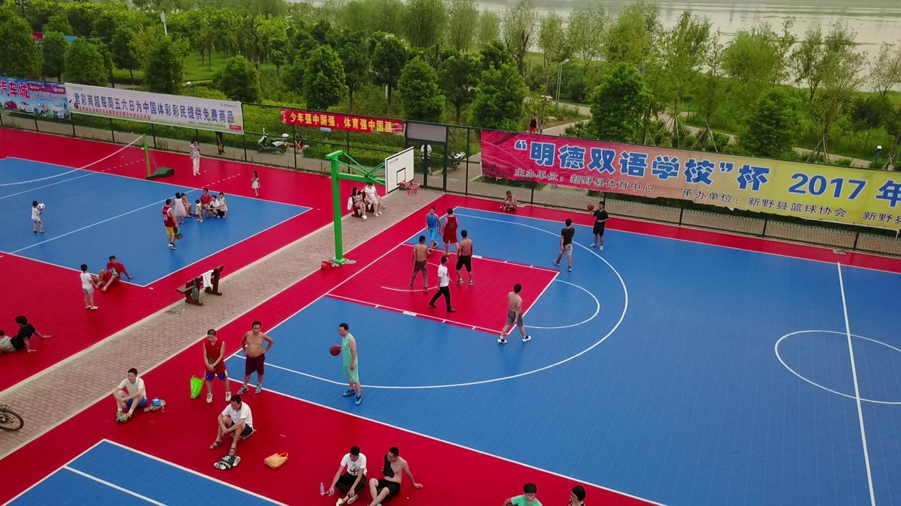
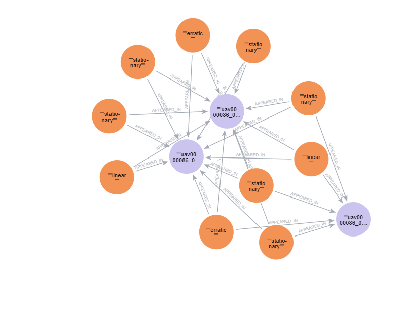
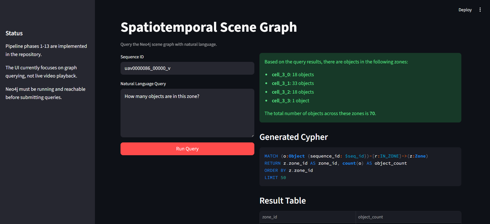
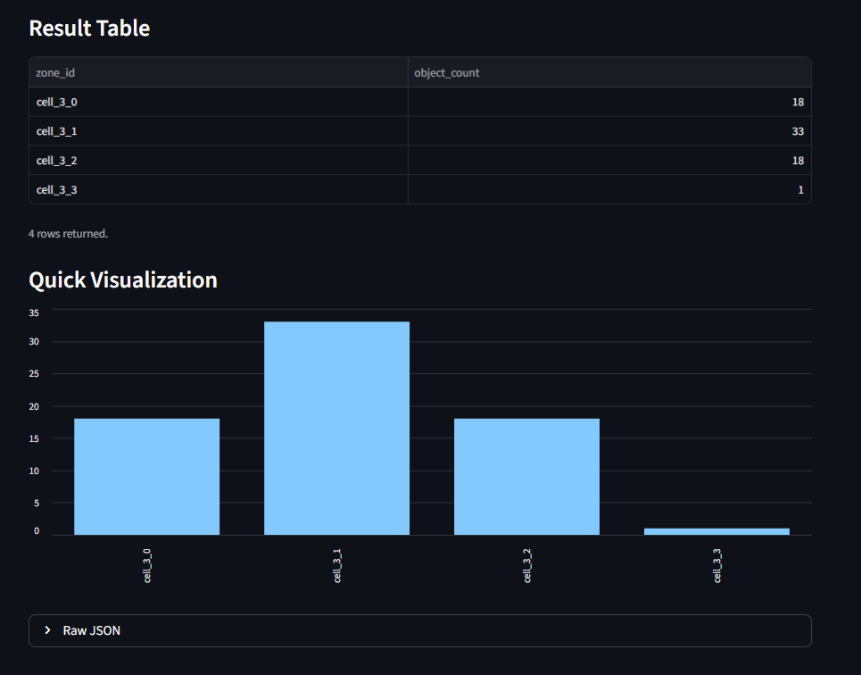

# Spatiotemporal Scene Graph Pipeline

This project ingests drone-video-derived scene data, builds a Neo4j-backed
spatiotemporal graph, and exposes the graph through a natural-language query
interface.



Raw feed example (from VisDrone Dataset):


Graph for above enviornment in Neo4j can look something like this:


Query (& results) against this real environment (powered by a locally running `Qwen 3.5 4GB Q4_K_M` via `llama.cpp`):



## What is implemented

- VisDrone dataset download and environment bootstrap scripts
- Neo4j Docker setup
- sequence loading and metadata parsing
- YOLOv8 detection
- ByteTrack tracking
- motion and zone enrichment
- graph writes into Neo4j
- rule-based event detection
- entity-resolution post-processing helpers
- LLM query agent with OpenAI and OpenAI-compatible endpoint support
- evaluation scripts
- Streamlit query UI
- pipeline and query CLIs

## Quickstart

### 1. Set up the environment

```bash
bash infra/setup_env.sh
```

If your virtualenv already existed before the latest updates, reinstall
dependencies so `streamlit` is present:

```bash
venv/bin/pip install -r requirements.txt
```

### 2. Download assets

Default dataset-and-weights download:

```bash
bash infra/download_visdrone.sh
```

Other useful variants:

```bash
bash infra/download_visdrone.sh --weights
bash infra/download_visdrone.sh --all
```

### 3. Start Neo4j

```bash
docker compose -f infra/docker-compose.yml up -d
docker compose -f infra/docker-compose.yml ps
```

### 4. Configure the LLM endpoint

LLM settings live in `configs/llm.yaml`.

OpenAI example:

```yaml
llm:
  model: gpt-4o-mini
  connection:
    base_url: null
    api_key: null
    api_key_env: OPENAI_API_KEY
```

`llama.cpp` example:

```yaml
llm:
  model: qwen2.5-7b-instruct
  connection:
    base_url: http://127.0.0.1:8080/v1
    api_key: llama-local
    api_key_env: OPENAI_API_KEY
```

### 5. Ingest a sequence into Neo4j

Pipeline CLI:

```bash
venv/bin/python pipeline/runner.py --sequence uav0000009_04358_v --post-process --json
```

Example script:

```bash
venv/bin/python examples/ingest_sequence_to_neo4j.py --sequence uav0000009_04358_v --post-process
```

### 6. Query the graph

CLI:

```bash
venv/bin/python agents/llm_agent.py --sequence uav0000009_04358_v --question "Which vehicles were stationary for more than 60 frames?"
```

Streamlit UI:

```bash
venv/bin/streamlit run ui/app.py
```

## Additional docs

- [Usage Guide](/home/saksham/codebase/deep-learning-project/docs/usage.md)
- [LLM Agent Notes](/home/saksham/codebase/deep-learning-project/docs/llm_agent_phase10.md)
- [Evaluation Tools](/home/saksham/codebase/deep-learning-project/docs/evaluation_tools_phase11.md)

## Current watchouts

- the pipeline has reusable runtime surfaces and CLIs, but it is still a research-scale implementation rather than a production deployment
- the Streamlit UI is for querying graph results, not for interactive video playback or graph-node rendering
- entity resolution is now wired as a sequence-final post-processing step, but it depends on the graph already containing the sequence history
- evaluation scripts are lightweight JSON-driven evaluators, not full external benchmark integrations

## Status

All phases currently listed in `TASKS.md`, including the Phase 13 follow-up
integration tasks, are complete.
