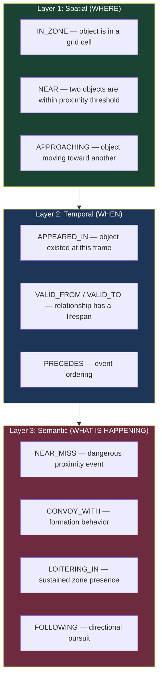
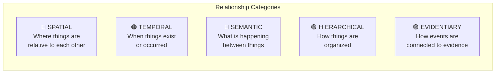
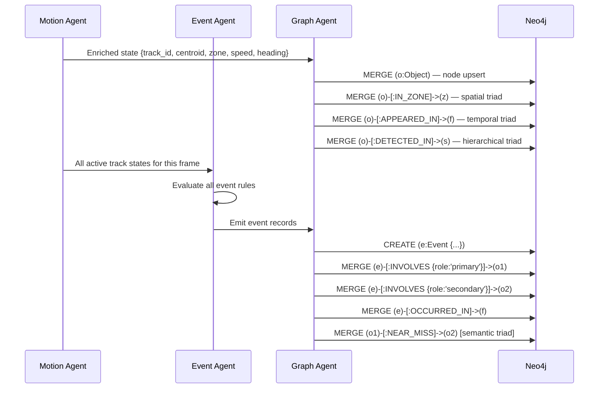
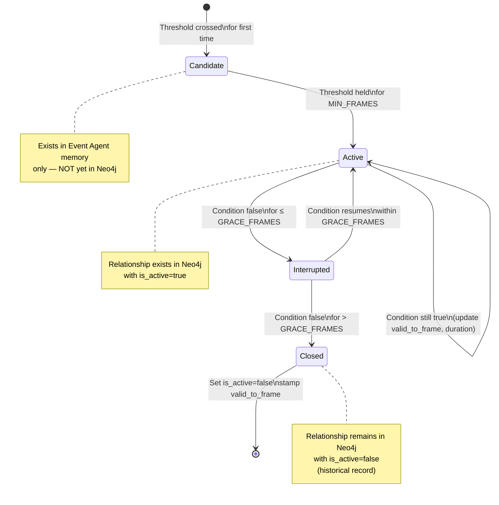
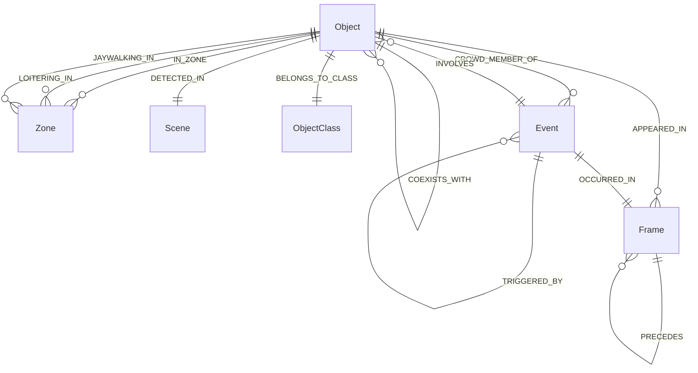
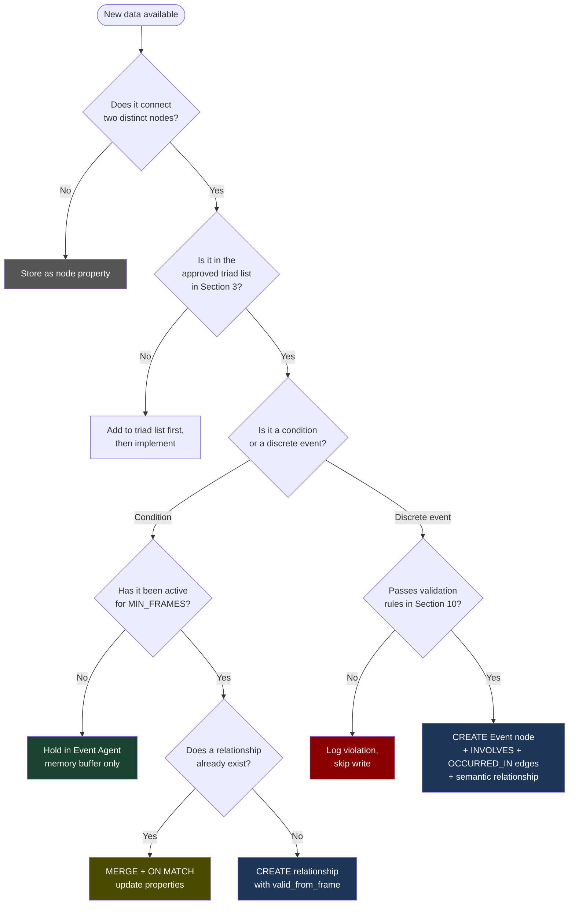

# relationships.md — Graph Relationship Specification

> Companion to AGENTS.md. This document defines **exactly how relationships are constructed,
> typed, validated, and queried** in the Neo4j graph database. Written for coding agents.
> Do not write relationship logic without reading this file first.

> **Current implementation note:** much of this document still describes the
> intended relationship ontology, not the full set of relationships currently
> written by the codebase. The subset that is actually persisted today, and the
> resulting limitations, are documented in
> [docs/graph_generation_shortcomings.md](/home/saksham/codebase/deep-learning-project/docs/graph_generation_shortcomings.md).

---

## Table of Contents

1. [Core Design Philosophy](#1-core-design-philosophy)
2. [Relationship Taxonomy](#2-relationship-taxonomy)
3. [Subject → Predicate → Object Triads (VidSGG Layer)](#3-subject--predicate--object-triads-vidsgg-layer)
4. [Spatial Relationship Construction](#4-spatial-relationship-construction)
5. [Temporal Relationship Construction](#5-temporal-relationship-construction)
6. [Semantic / Behavioral Relationship Construction](#6-semantic--behavioral-relationship-construction)
7. [Hierarchical Relationships](#7-hierarchical-relationships)
8. [Entity Resolution and Deduplication](#8-entity-resolution-and-deduplication)
9. [Relationship Lifecycle Management](#9-relationship-lifecycle-management)
10. [Relationship Validation Rules](#10-relationship-validation-rules)
11. [Full Relationship Schema Reference](#11-full-relationship-schema-reference)
12. [Graph Traversal Patterns for LLM Agent](#12-graph-traversal-patterns-for-llm-agent)

---

## 1. Core Design Philosophy

### The Semantic Triad

Every relationship in this graph must be expressible as a **Subject → Predicate → Object** triad. This is not optional — it is the fundamental unit of meaning in the graph. Before creating any new relationship type, write it in this form first.

```
(car:Object) -[:NEAR_MISS]-> (pedestrian:Object)
(pedestrian:Object) -[:IN_ZONE]-> (zone:Zone)
(event:Event) -[:INVOLVES {role: "primary"}]-> (object:Object)
(object:Object) -[:DETECTED_IN]-> (scene:Scene)
```

If you cannot express a relationship as a clean triad, the relationship is either:
- Too ambiguous → split into two simpler relationships
- Already captured by a node property → store it there instead

### Three Layers of Meaning

Relationships in this graph carry meaning at three levels, which must be kept distinct:



**Rule:** Do not collapse layers. A `NEAR_MISS` is a Layer 3 relationship (semantic event). The underlying proximity that triggered it is a Layer 1 relationship (`NEAR`). Both should exist in the graph independently — one does not replace the other.

### Relationship vs. Property Decision Rule

Use a **relationship** when:
- The information connects two distinct nodes
- The information has its own temporal validity (it changes over time)
- You would ever want to traverse or pattern-match on it

Use a **node property** when:
- The information describes only one node
- It is a scalar value that does not change structurally (speed, class, confidence)
- It would never be the subject of a graph traversal

---

## 2. Relationship Taxonomy

All relationships in the system fall into five categories. Each category has strict rules about what nodes it may connect, what properties it must carry, and how it is generated.



### Category Summary Table

| Category | Relationship Types | Generated By | Cardinality |
|---|---|---|---|
| Spatial | `IN_ZONE`, `NEAR`, `APPROACHING`, `OVERLAPS` | Motion Agent (frame-by-frame) | Many-to-many, per-frame |
| Temporal | `APPEARED_IN`, `PRECEDES`, `COEXISTS_WITH` | Graph Agent (every frame) | Many-to-many |
| Semantic | `NEAR_MISS`, `CONVOY_WITH`, `LOITERING_IN`, `FOLLOWING`, `CROWD_MEMBER_OF`, `JAYWALKING_IN` | Event Agent (on threshold breach) | Created once per event instance |
| Hierarchical | `DETECTED_IN`, `BELONGS_TO_CLASS` | Graph Agent (on node creation) | Many-to-one |
| Evidentiary | `INVOLVES`, `OCCURRED_IN`, `TRIGGERED_BY` | Graph Agent (on event write) | Many-to-one from Event node |

---

## 3. Subject → Predicate → Object Triads (VidSGG Layer)

This section defines the complete set of valid triads. **Only relationships in this list should be created.** Adding a new relationship type requires adding it here first.

### 3.1 Spatial Triads

```
(Object) -[:IN_ZONE]->          (Zone)
(Object) -[:NEAR]->             (Object)
(Object) -[:APPROACHING]->      (Object)
(Object) -[:OVERLAPS_WITH]->    (Zone)    [object bbox partially exits zone boundary]
```

### 3.2 Temporal Triads

```
(Object) -[:APPEARED_IN]->      (Frame)
(Event)  -[:OCCURRED_IN]->      (Frame)
(Frame)  -[:PRECEDES]->         (Frame)   [only between adjacent frames — not all pairs]
(Object) -[:COEXISTS_WITH]->    (Object)  [both alive in same frame window]
```

### 3.3 Semantic / Event Triads

```
(Object) -[:NEAR_MISS]->        (Object)  [directional: pedestrian toward vehicle]
(Object) -[:CONVOY_WITH]->      (Object)  [symmetric: both nodes get this edge]
(Object) -[:LOITERING_IN]->     (Zone)
(Object) -[:FOLLOWING]->        (Object)  [directional: follower toward leader]
(Object) -[:CROWD_MEMBER_OF]->  (Event)   [where Event.type = CROWD_FORM]
(Object) -[:JAYWALKING_IN]->    (Zone)
```

### 3.4 Hierarchical Triads

```
(Object) -[:DETECTED_IN]->      (Scene)
(Object) -[:BELONGS_TO_CLASS]-> (ObjectClass)   [class taxonomy node, created once]
(Event)  -[:CLASSIFIED_AS]->    (EventClass)    [event taxonomy node, created once]
```

### 3.5 Evidentiary Triads

```
(Event)  -[:INVOLVES {role}]->  (Object)  [role: "primary" | "secondary"]
(Event)  -[:OCCURRED_IN]->      (Frame)
(Event)  -[:TRIGGERED_BY]->     (Event)   [causal chain: CROWD_FORM may trigger LOITER]
```

### Triad Generation Flow



---

## 4. Spatial Relationship Construction

### 4.1 IN_ZONE

**What it represents:** An object's centroid falls within a specific grid cell at a given frame.

**How to construct:**
1. Compute normalized centroid `(cx, cy)` from bbox.
2. Assign zone via `row = floor(cy * GRID_SIZE)`, `col = floor(cx * GRID_SIZE)`.
3. Zone ID format: `"cell_{row}_{col}"` (e.g., `"cell_2_3"` for row=2, col=3 in a 4×4 grid).
4. MERGE the Zone node, then MERGE the relationship.

**Properties on relationship:**

| Property | Type | Description |
|---|---|---|
| `frame_id` | int | Frame when this zone assignment was recorded |
| `centroid` | list[float] | Exact `[cx, cy]` at this frame |
| `duration_frames` | int | Updated each frame the object stays in this zone |

**Write pattern:**
```
MERGE (z:Zone {zone_id: $zone_id, sequence_id: $seq_id})
MERGE (o)-[r:IN_ZONE]->(z)
ON CREATE SET r.frame_id = $frame_id, r.entry_frame = $frame_id, r.duration_frames = 1
ON MATCH SET r.frame_id = $frame_id, r.duration_frames = r.duration_frames + 1
```

**Important:** Do NOT create a new `IN_ZONE` relationship every frame. Use MERGE with ON MATCH to update the existing one. The relationship represents the **current** zone assignment, not a history. Zone history is captured via the `APPEARED_IN → Frame` chain if needed.

---

### 4.2 NEAR

**What it represents:** Two objects are within a configurable proximity threshold in the same frame. This is a raw spatial fact, distinct from any semantic interpretation.

**How to construct:**
1. For each frame, compute pairwise Euclidean distances between all active track centroids.
2. Use a spatial index (scipy `cKDTree`) to avoid O(n²) computation on dense frames.
3. Only create `NEAR` edges when distance < `NEAR_THRESHOLD` (default: `0.08` normalized units).
4. The relationship is **directional by convention** — always write from lower `track_id` to higher `track_id` to avoid duplicate edges.

**Properties on relationship:**

| Property | Type | Description |
|---|---|---|
| `distance` | float | Normalized Euclidean distance at this frame |
| `frame_id` | int | Frame when proximity was detected |
| `both_moving` | bool | True if both objects have speed > STATIONARY_THRESH |

**Write pattern:**
```
MATCH (o1:Object {track_id: $tid_low, sequence_id: $seq_id})
MATCH (o2:Object {track_id: $tid_high, sequence_id: $seq_id})
MERGE (o1)-[r:NEAR]->(o2)
SET r.distance = $distance, r.frame_id = $frame_id, r.both_moving = $both_moving
```

**Threshold configuration (in `configs/event.yaml`):**
```yaml
spatial:
  near_threshold: 0.08          # normalized units
  approaching_angle_max: 45     # degrees — heading must point toward other object
  grid_size: 4                  # NxN zone grid
```

---

### 4.3 APPROACHING

**What it represents:** Object A's heading vector points toward Object B, and the distance is decreasing across frames.

**How to construct:**
1. Compute the angle from Object A's centroid to Object B's centroid: `bearing = atan2(dy, dx)`.
2. Compute the angular difference between A's heading and this bearing.
3. If `|heading_diff| < APPROACHING_ANGLE_MAX` AND `distance_t < distance_{t-1}`: create relationship.

**Properties on relationship:**

| Property | Type | Description |
|---|---|---|
| `closing_speed` | float | Rate of distance decrease (normalized units/frame) |
| `angle_diff` | float | Degrees between heading and bearing to target |
| `frame_id` | int | Most recent frame when this was valid |

---

## 5. Temporal Relationship Construction

### 5.1 APPEARED_IN

**What it represents:** An object was detected (by YOLO + ByteTrack) in a specific frame. This is the primary temporal anchor for every object.

**How to construct:** Write for every tracked object, every frame it appears. This is high-volume — batch with the 30-frame buffer.

**Properties on relationship:**

| Property | Type | Description |
|---|---|---|
| `centroid` | list[float] | `[cx, cy]` at this exact frame |
| `bbox_norm` | list[float] | `[x1, y1, x2, y2]` normalized |
| `confidence` | float | YOLO detection confidence |
| `occlusion` | int | 0=none, 1=partial, 2=heavy |
| `speed` | float | Computed speed at this frame |
| `heading` | float | Computed heading at this frame |

**Note on storage:** Do NOT store the full trajectory buffer in this relationship. The trajectory is reconstructed by traversing `(Object)-[:APPEARED_IN]->(Frame)` in frame order. The Object node's `trajectory_buffer` property is a rolling cache of the last 30 centroids only.

---

### 5.2 PRECEDES

**What it represents:** Frame N directly precedes Frame N+1. This forms the temporal backbone of the graph.

**Construction rule:** Only create between **adjacent** frames (`frame_id` differs by exactly 1). Do NOT create transitive precedence edges (no Frame 1 → Frame 50 edges). Traversal handles transitivity.

**Write pattern:** Create once during sequence initialization, not per-detection:
```
UNWIND range($start_frame, $end_frame - 1) AS fid
MERGE (f1:Frame {frame_id: fid, sequence_id: $seq_id})
MERGE (f2:Frame {frame_id: fid + 1, sequence_id: $seq_id})
MERGE (f1)-[:PRECEDES]->(f2)
```

---

### 5.3 COEXISTS_WITH

**What it represents:** Two objects were both active (tracked) within the same time window. Used to build co-presence analysis without requiring per-frame pairwise queries.

**Construction rule:** Create after a sequence is fully processed (post-processing step). For each pair of objects whose `[first_seen_frame, last_seen_frame]` intervals overlap, create this relationship.

**Properties on relationship:**

| Property | Type | Description |
|---|---|---|
| `overlap_start` | int | First frame both objects were active |
| `overlap_end` | int | Last frame both objects were active |
| `overlap_frames` | int | Duration of overlap |
| `min_distance_ever` | float | Closest they ever got (populated post-hoc) |

**When to create:** During a post-processing pass after the full sequence is ingested. This is a derived relationship, not a real-time one.

---

### 5.4 Temporal Validity on All Relationships

Inspired by the Defense OSDK's `Valid_From / Valid_To` pattern: **every relationship that represents a condition (not a discrete event) must carry temporal validity properties.**

This applies to: `IN_ZONE`, `NEAR`, `APPROACHING`, `CONVOY_WITH`, `FOLLOWING`, `LOITERING_IN`.

| Property | Type | Meaning |
|---|---|---|
| `valid_from_frame` | int | Frame when this condition first became true |
| `valid_to_frame` | int | Frame when this condition last held (updated each frame) |
| `is_active` | bool | True if condition still holds in the latest processed frame |

When a condition ends (e.g., two objects move apart), set `is_active = false` and stamp `valid_to_frame`. Do **not** delete the relationship — it is historical evidence.

---

## 6. Semantic / Behavioral Relationship Construction

These relationships are created by the **Event Agent** and written by the **Graph Agent**. They represent conclusions drawn from patterns in spatial and temporal data. Each has a precise trigger condition.

### 6.1 NEAR_MISS

**Semantic meaning:** A potentially dangerous proximity event between a vulnerable road user (pedestrian/cyclist/motor) and a vehicle, where at least one party is moving.

**Trigger condition (all must be true):**
- Object A class ∈ `{pedestrian, people, bicycle, motor, tricycle, awning-tricycle}`
- Object B class ∈ `{car, van, truck, bus}`
- Euclidean distance between centroids < `NEAR_MISS_DIST` (0.05 normalized)
- Max(speed_A, speed_B) > `NEAR_MISS_MIN_SPEED` (0.004 normalized/frame)

**Direction:** Always write from the vulnerable party toward the vehicle: `(pedestrian)-[:NEAR_MISS]->(car)`.

**Properties:**

| Property | Type | Description |
|---|---|---|
| `distance` | float | Closest distance achieved |
| `frame_id` | int | Frame of closest approach |
| `speed_a` | float | Speed of primary object |
| `speed_b` | float | Speed of secondary object |
| `severity` | str | `"critical"` if dist < 0.03, else `"warning"` |
| `valid_from_frame` | int | Frame proximity window opened |
| `valid_to_frame` | int | Frame proximity window closed |

**De-duplication rule:** If the same pair (A, B) triggers NEAR_MISS within 30 frames of a previous NEAR_MISS, update the existing relationship rather than creating a new one. Two separate NEAR_MISS relationships between the same pair must be separated by > 30 frames.

---

### 6.2 CONVOY_WITH

**Semantic meaning:** Two or more vehicles are traveling in coordinated formation — consistent relative distance and parallel headings — over a sustained time window.

**Trigger condition (all must be true for N consecutive frames ≥ `CONVOY_MIN_FRAMES`):**
- Both objects class ∈ `{car, van, truck, bus}`
- Both objects `movement_pattern = "linear"`
- Distance between centroids within `[CONVOY_DIST_MIN, CONVOY_DIST_MAX]` (0.03 to 0.12)
- `|heading_A - heading_B|` < `CONVOY_HEADING_DIFF` (20 degrees)
- Distance variance across N frames < `CONVOY_DIST_VARIANCE` (0.005)

**Direction:** Symmetric. Write the relationship in both directions: `(A)-[:CONVOY_WITH]->(B)` and `(B)-[:CONVOY_WITH]->(A)`.

**Properties:**

| Property | Type | Description |
|---|---|---|
| `valid_from_frame` | int | Frame convoy formation was confirmed |
| `valid_to_frame` | int | Frame convoy broke up (updated live) |
| `is_active` | bool | Whether convoy is currently active |
| `avg_distance` | float | Mean inter-vehicle distance during convoy |
| `avg_heading` | float | Mean shared heading direction |
| `duration_frames` | int | Total frames convoy persisted |

**State management:** Use a `convoy_candidate_buffer` dict in Event Agent memory: `{(tid_A, tid_B): consecutive_frame_count}`. Only emit the relationship when count ≥ `CONVOY_MIN_FRAMES` (default: 45). Reset to 0 if any condition fails for more than 5 frames (allow brief interruptions).

---

### 6.3 LOITERING_IN

**Semantic meaning:** A pedestrian or person remains in a single zone for an extended period while stationary or near-stationary.

**Trigger condition:**
- Object class ∈ `{pedestrian, people}`
- Object `movement_pattern = "stationary"`
- Same `zone_id` for ≥ `LOITER_MIN_FRAMES` (default: 90 frames = 3 seconds at 30fps)

**Direction:** `(Object)-[:LOITERING_IN]->(Zone)`

**Properties:**

| Property | Type | Description |
|---|---|---|
| `valid_from_frame` | int | Frame loitering began |
| `valid_to_frame` | int | Frame loitering ended (or null if ongoing) |
| `is_active` | bool | Whether still loitering |
| `duration_frames` | int | Total frames loitering |
| `peak_duration` | int | Longest uninterrupted loiter stretch |

**State management:** Use a `zone_residence_counter` dict: `{track_id: {zone_id: frame_count}}`. Reset counter when zone changes. Emit the relationship when threshold is crossed. Update `duration_frames` every subsequent frame.

---

### 6.4 FOLLOWING

**Semantic meaning:** Object A persistently moves in the same direction as Object B, maintaining a consistent trailing distance. Directional pursuit behavior.

**Trigger condition (sustained for ≥ `FOLLOW_MIN_FRAMES`):**
- `APPROACHING` relationship exists from A to B
- `closing_speed` is near-zero (not actually getting closer, just trailing)
- Distance within `[FOLLOW_DIST_MIN, FOLLOW_DIST_MAX]`
- `|heading_A - heading_B|` < 30 degrees
- Both speeds > `STATIONARY_THRESH`

**Direction:** `(follower)-[:FOLLOWING]->(leader)`. Always directional.

**Properties:**

| Property | Type | Description |
|---|---|---|
| `valid_from_frame` | int | When following began |
| `valid_to_frame` | int | When following ended |
| `is_active` | bool | Ongoing |
| `avg_trail_distance` | float | Mean distance maintained |

---

### 6.5 CROWD_MEMBER_OF

**Semantic meaning:** An object is part of a crowd formation event. Links individual pedestrians to the crowd event node.

**Trigger condition:** Created when `CROWD_FORM` event fires. All pedestrians in the triggering zone at the trigger frame become crowd members.

**Direction:** `(Object)-[:CROWD_MEMBER_OF]->(Event)` where Event.event_type = `"CROWD_FORM"`.

**Properties:**

| Property | Type | Description |
|---|---|---|
| `join_frame` | int | Frame the object was in the zone when crowd formed |
| `centroid_at_join` | list[float] | Position when crowd was detected |

---

### 6.6 JAYWALKING_IN

**Semantic meaning:** A pedestrian is detected in a zone that is statistically dominated by vehicle traffic.

**Trigger condition:**
- Object class ∈ `{pedestrian, people}`
- Zone's `vehicle_ratio` > 0.80 (updated by Motion Agent per frame)
- Zone's `pedestrian_ratio` < 0.20

**Direction:** `(Object)-[:JAYWALKING_IN]->(Zone)`

**Properties:**

| Property | Type | Description |
|---|---|---|
| `frame_id` | int | Frame when detected |
| `vehicle_ratio` | float | Zone vehicle ratio at detection time |
| `speed` | float | Pedestrian speed at detection |
| `valid_from_frame` | int | Entry into vehicle zone |
| `valid_to_frame` | int | Exit from vehicle zone |

---

## 7. Hierarchical Relationships

These are created once per object/event and do not change.

### 7.1 DETECTED_IN (Object → Scene)

Created when an Object node is first seen in a sequence. The Scene node is created once per sequence from VisDrone metadata.

```
(o:Object)-[:DETECTED_IN]->(s:Scene {sequence_id: $seq_id})
```

No properties required on this relationship — all metadata lives on the Scene node.

### 7.2 BELONGS_TO_CLASS (Object → ObjectClass)

Provides a class taxonomy layer. ObjectClass nodes are created once at startup for all 10 VisDrone classes.

```
(o:Object)-[:BELONGS_TO_CLASS]->(c:ObjectClass {name: "car"})
```

This allows class-based graph traversal without string matching on Object properties. Useful for LLM queries like "find all vehicles" which traverse `:BELONGS_TO_CLASS` to a set of ObjectClass nodes rather than matching multiple string values.

**ObjectClass taxonomy (create at startup):**
```
VulnerableRoadUser
  ├── pedestrian
  ├── people
  ├── bicycle
  ├── motor
  └── tricycle

MotorVehicle
  ├── car
  ├── van
  ├── truck
  ├── bus
  └── awning-tricycle
```

Store the parent group on the ObjectClass node as `class_group: "VulnerableRoadUser"` or `"MotorVehicle"`. The LLM system prompt should describe this taxonomy so LLMs can write class-group queries.

---

## 8. Entity Resolution and Deduplication

ByteTrack loses tracks under heavy occlusion, potentially assigning the same physical object two different `track_id` values in the same sequence. This is the entity resolution problem. The graph handles this with a dedicated mechanism.

### 8.1 Re-identification Strategy

**During sequence processing:** ByteTrack is the primary identity source. Accept its `track_id` as-is.

**Post-processing pass (after full sequence is ingested):** Run a re-identification check to find candidate duplicate track pairs.

### 8.2 Duplicate Candidate Detection

Two tracks are candidates for re-identification if ALL of the following hold:

```
Condition 1 (Temporal): Track A ends before Track B starts (no overlap)
    → A.last_seen_frame < B.first_seen_frame

Condition 2 (Spatial Continuity): Track B's first centroid is near Track A's last centroid
    → distance(A.last_centroid, B.first_centroid) < REID_SPATIAL_THRESH (0.10)

Condition 3 (Class Match): Same object class
    → A.class == B.class

Condition 4 (Temporal Gap): Gap between them is small (lost during occlusion)
    → B.first_seen_frame - A.last_seen_frame < REID_TEMPORAL_GAP (60 frames)

Condition 5 (Motion Continuity): B's initial heading is consistent with A's final heading
    → |A.heading_at_exit - B.heading_at_entry| < 45 degrees
```

### 8.3 Handling Confirmed Duplicates

Do NOT delete either node. Instead:

1. Keep both `track_id` nodes as-is.
2. Create a `SAME_ENTITY_AS` relationship between them:

```
(o_A:Object)-[:SAME_ENTITY_AS {
    confidence: 0.85,
    method: "spatial_temporal_reid",
    resolved_at_frame: B.first_seen_frame
}]->(o_B:Object)
```

3. Set a `canonical_id` property on both nodes pointing to the lower `track_id`:
   - `o_A.canonical_id = A.track_id` (it is the canonical)
   - `o_B.canonical_id = A.track_id` (it defers to A)

4. When the LLM query agent is asked about trajectory, it should merge tracks sharing a `canonical_id`.

### 8.4 SAME_ENTITY_AS Relationship

```
(Object) -[:SAME_ENTITY_AS]-> (Object)
```

| Property | Type | Description |
|---|---|---|
| `confidence` | float | 0–1 confidence of the re-ID decision |
| `method` | str | `"spatial_temporal_reid"` |
| `resolved_at_frame` | int | Frame at which resolution was performed |

---

## 9. Relationship Lifecycle Management

### 9.1 State Machine for Condition-Based Relationships

Relationships like `IN_ZONE`, `NEAR`, `CONVOY_WITH`, `FOLLOWING`, `LOITERING_IN` represent **ongoing conditions** rather than discrete events. They follow this state machine:



**Grace frames by relationship type:**

| Relationship | MIN_FRAMES to activate | GRACE_FRAMES (interruption tolerance) |
|---|---|---|
| `IN_ZONE` | 1 (immediate) | 5 |
| `NEAR` | 1 (immediate) | 3 |
| `CONVOY_WITH` | 45 | 10 |
| `FOLLOWING` | 30 | 8 |
| `LOITERING_IN` | 90 | 15 |
| `APPROACHING` | 3 | 2 |

### 9.2 Track Termination

When ByteTrack marks a track as `is_lost = True`:

1. Set `Object.status = "lost"` on the node.
2. Set `is_active = false` on all condition-based relationships the object participates in.
3. Stamp `valid_to_frame` on all those relationships.
4. Do NOT delete any nodes or relationships.

When a track reappears (new `track_id` assigned by ByteTrack for what may be the same object):
- The Re-ID post-processing step will link them via `SAME_ENTITY_AS`.
- The new track starts fresh relationships.

### 9.3 Sequence Completion

After processing the final frame of a sequence:

1. Close all remaining `is_active = true` relationships (set to false, stamp `valid_to_frame`).
2. Run the `COEXISTS_WITH` post-processing pass.
3. Run the `SAME_ENTITY_AS` re-identification pass.
4. Compute and set `vehicle_ratio` and `pedestrian_ratio` final values on all Zone nodes.

---

## 10. Relationship Validation Rules

The Graph Agent must enforce these rules before writing any relationship. Violations should be logged and the write skipped — never silently write invalid relationships.

### Structural Rules

```
RULE S1: No self-relationships
  Reject: (o1)-[r]->(o2) where o1.track_id == o2.track_id

RULE S2: Sequence scope
  Reject: Any relationship crossing sequence boundaries
  All nodes in a relationship must share the same sequence_id

RULE S3: Valid frame reference
  Reject: APPEARED_IN where frame_id < Object.first_seen_frame
          or frame_id > Object.last_seen_frame

RULE S4: Temporal ordering
  Reject: PRECEDES where source.frame_id >= target.frame_id

RULE S5: Class constraint on semantic relationships
  NEAR_MISS: primary must be VulnerableRoadUser, secondary must be MotorVehicle
  CONVOY_WITH: both must be MotorVehicle
  LOITERING_IN: object must be VulnerableRoadUser
  JAYWALKING_IN: object must be VulnerableRoadUser
```

### Property Completeness Rules

```
RULE P1: Every APPEARED_IN must have: centroid, confidence, occlusion
RULE P2: Every NEAR must have: distance, frame_id
RULE P3: Every semantic relationship must have: valid_from_frame
RULE P4: Every Event node must have: event_type, frame_id, sequence_id, confidence
RULE P5: Every INVOLVES must have: role ("primary" or "secondary")
```

### Cardinality Rules

```
RULE C1: An Object can have at most one IN_ZONE relationship at any frame
  (enforce by MERGE + ON MATCH update, never CREATE)

RULE C2: NEAR_MISS between the same pair requires > 30 frame gap
  (check before creating)

RULE C3: A track can only be canonical_id for one other track
  (one-to-one re-ID by default; flag ambiguous cases for review)
```

---

## 11. Full Relationship Schema Reference



### Complete Property Reference

```
[:IN_ZONE]
  frame_id: int
  centroid: [float, float]
  duration_frames: int
  entry_frame: int
  valid_from_frame: int
  valid_to_frame: int
  is_active: bool

[:APPEARED_IN]
  centroid: [float, float]
  bbox_norm: [float, float, float, float]
  confidence: float
  occlusion: int          # 0, 1, 2
  speed: float
  heading: float

[:NEAR]
  distance: float
  frame_id: int
  both_moving: bool
  valid_from_frame: int
  valid_to_frame: int
  is_active: bool

[:APPROACHING]
  closing_speed: float
  angle_diff: float
  frame_id: int
  valid_from_frame: int
  valid_to_frame: int
  is_active: bool

[:NEAR_MISS]
  distance: float
  frame_id: int
  speed_a: float
  speed_b: float
  severity: str           # "critical" | "warning"
  valid_from_frame: int
  valid_to_frame: int

[:CONVOY_WITH]
  valid_from_frame: int
  valid_to_frame: int
  is_active: bool
  avg_distance: float
  avg_heading: float
  duration_frames: int

[:FOLLOWING]
  valid_from_frame: int
  valid_to_frame: int
  is_active: bool
  avg_trail_distance: float

[:LOITERING_IN]
  valid_from_frame: int
  valid_to_frame: int
  is_active: bool
  duration_frames: int
  peak_duration: int

[:JAYWALKING_IN]
  frame_id: int
  vehicle_ratio: float
  speed: float
  valid_from_frame: int
  valid_to_frame: int

[:CROWD_MEMBER_OF]
  join_frame: int
  centroid_at_join: [float, float]

[:INVOLVES]
  role: str               # "primary" | "secondary"

[:SAME_ENTITY_AS]
  confidence: float
  method: str
  resolved_at_frame: int

[:COEXISTS_WITH]
  overlap_start: int
  overlap_end: int
  overlap_frames: int
  min_distance_ever: float

[:PRECEDES]
  (no properties — structural only)

[:DETECTED_IN]
  (no properties — structural only)

[:BELONGS_TO_CLASS]
  (no properties — structural only)

[:TRIGGERED_BY]
  (no properties — structural only)
```

---

## 12. Graph Traversal Patterns for LLM Agent

This section defines the canonical Cypher traversal patterns the LLM should generate for common query types. Include these as few-shot examples in the system prompt.

### Pattern 1: Object History (Full Trajectory)

```cypher
// "Show me the path that track 42 took through the sequence"
MATCH (o:Object {track_id: 42, sequence_id: $seq_id})-[r:APPEARED_IN]->(f:Frame)
RETURN r.centroid, f.frame_id
ORDER BY f.frame_id ASC
```

### Pattern 2: All Events Involving an Object

```cypher
// "What happened to vehicle 17?"
MATCH (e:Event)-[:INVOLVES]->(o:Object {track_id: 17, sequence_id: $seq_id})
RETURN e.event_type, e.frame_id, e.metadata
ORDER BY e.frame_id ASC
```

### Pattern 3: Zone Density at a Point in Time

```cypher
// "Which zones were most crowded at frame 300?"
MATCH (o:Object {sequence_id: $seq_id})-[r:IN_ZONE]->(z:Zone)
WHERE r.frame_id = 300
RETURN z.zone_id, count(o) AS density
ORDER BY density DESC
```

### Pattern 4: Near Misses in a Condition Window

```cypher
// "Were there near misses in foggy weather?"
MATCH (sc:Scene {weather: 'foggy', sequence_id: $seq_id})<-[:DETECTED_IN]-(o:Object)
MATCH (o)-[nm:NEAR_MISS]->(o2:Object)
RETURN o.track_id, o2.track_id, nm.distance, nm.frame_id, nm.severity
ORDER BY nm.severity DESC
```

### Pattern 5: Cross-Zone Object Movement

```cypher
// "Which objects moved from zone cell_0_0 to zone cell_3_3?"
MATCH (o:Object {sequence_id: $seq_id})
MATCH (o)-[r1:IN_ZONE]->(z1:Zone {zone_id: 'cell_0_0'})
MATCH (o)-[r2:IN_ZONE]->(z2:Zone {zone_id: 'cell_3_3'})
WHERE r1.entry_frame < r2.entry_frame
RETURN o.track_id, o.class, r1.entry_frame AS left_from, r2.entry_frame AS arrived_at
```

### Pattern 6: Class Group Query (uses taxonomy layer)

```cypher
// "Find all vulnerable road users near vehicles"
MATCH (vru:Object)-[:BELONGS_TO_CLASS]->(c1:ObjectClass {class_group: 'VulnerableRoadUser'})
MATCH (veh:Object)-[:BELONGS_TO_CLASS]->(c2:ObjectClass {class_group: 'MotorVehicle'})
MATCH (vru)-[n:NEAR]->(veh)
WHERE n.is_active = true AND vru.sequence_id = $seq_id
RETURN vru.track_id, vru.class, veh.track_id, veh.class, n.distance
```

### Pattern 7: Convoy Detection

```cypher
// "Are there any active convoys?"
MATCH (o1:Object)-[c:CONVOY_WITH]->(o2:Object)
WHERE c.is_active = true AND o1.sequence_id = $seq_id
  AND o1.track_id < o2.track_id   // deduplicate symmetric edges
RETURN o1.track_id, o2.track_id, c.duration_frames, c.avg_distance
```

### Pattern 8: Reconstructed Identity (Re-ID aware)

```cypher
// "Show me the full lifespan of what was probably the same car"
MATCH (o1:Object {track_id: $tid, sequence_id: $seq_id})
OPTIONAL MATCH (o1)-[:SAME_ENTITY_AS*1..3]-(o_related:Object)
WITH collect(DISTINCT o1) + collect(DISTINCT o_related) AS all_tracks
UNWIND all_tracks AS o
MATCH (o)-[r:APPEARED_IN]->(f:Frame)
RETURN o.track_id, r.centroid, f.frame_id
ORDER BY f.frame_id ASC
```

### Pattern 9: Loitering Hotspots Across Sequences

```cypher
// "Which zones have the most loitering across all sequences?"
MATCH (o:Object)-[l:LOITERING_IN]->(z:Zone)
RETURN z.zone_id, count(l) AS loiter_events, avg(l.duration_frames) AS avg_duration
ORDER BY loiter_events DESC
LIMIT 10
```

### Pattern 10: Causal Chain (Event Triggered By Event)

```cypher
// "Did any crowd formations lead to subsequent loitering?"
MATCH (e1:Event {event_type: 'CROWD_FORM'})-[:TRIGGERED_BY*0..2]-(e2:Event {event_type: 'LOITER'})
WHERE e1.sequence_id = $seq_id AND e1.frame_id < e2.frame_id
RETURN e1.frame_id AS crowd_frame, e2.frame_id AS loiter_frame,
       e2.frame_id - e1.frame_id AS frames_between
```

---

## Appendix: Relationship Construction Decision Tree

Use this when deciding whether and how to create a relationship:


