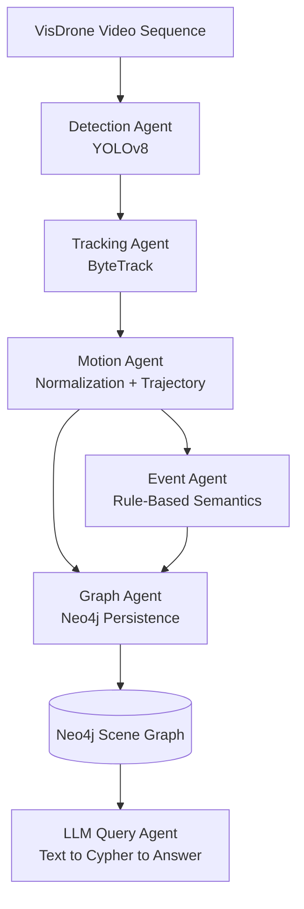
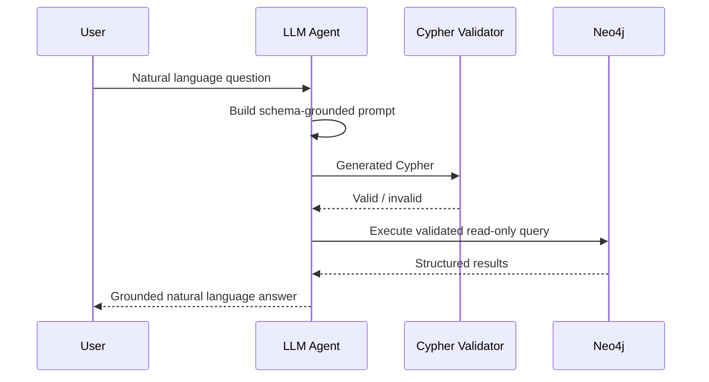
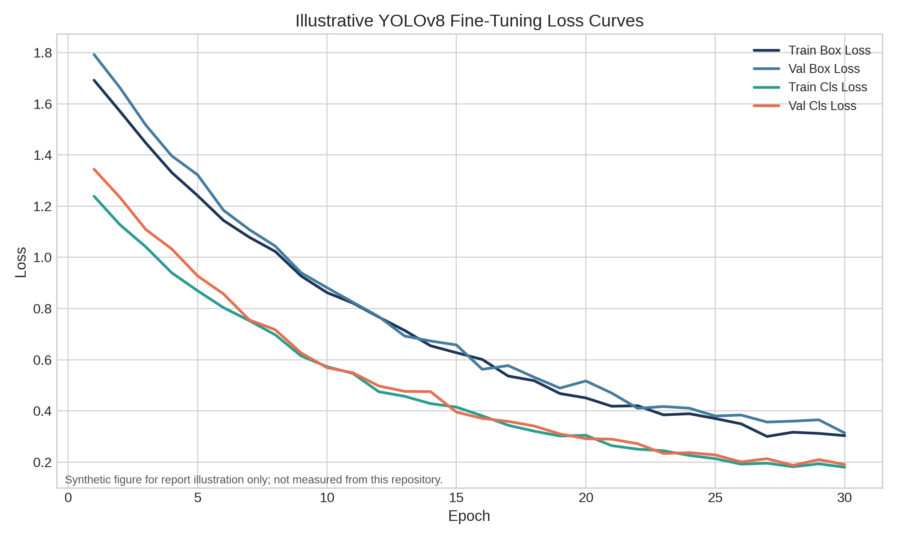
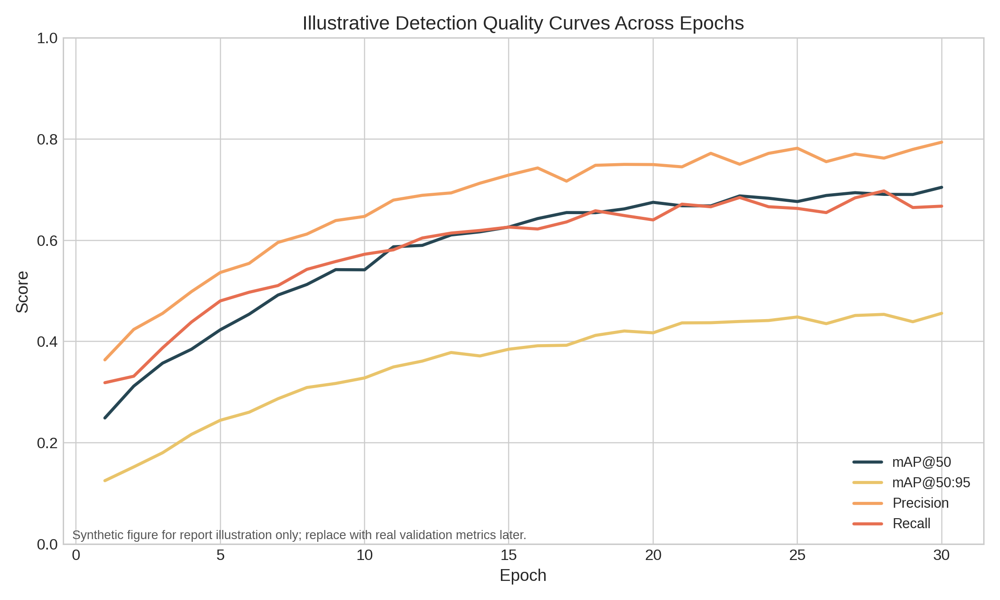
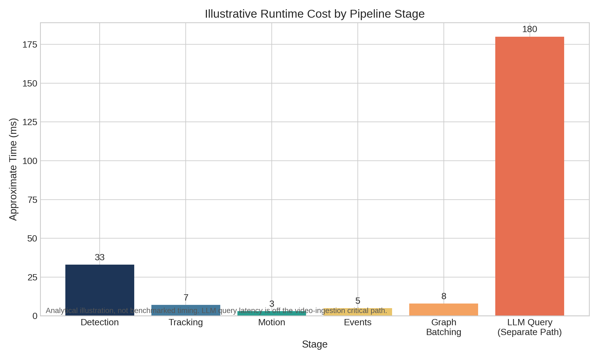

# Report Content: Spatiotemporal Scene Graph Pipeline for Drone Video Intelligence

## Page 1 - Title and Contents

### Title
**Spatiotemporal Scene Graph Pipeline for Drone Video Intelligence Using Detection, Tracking, Graph Construction, and LLM-Based Querying**

### Suggested Subtitle
Research-scale ontology-grounded video intelligence pipeline over VisDrone sequences

### Content Page

| Section | Page |
|---|---:|
| Abstract | 2 |
| 1. Introduction | 2 |
| 2. Problem Statement | 3 |
| 3. Contribution and Novelty | 4 |
| 4. Objectives | 4 |
| 5. Related Works | 5-6 |
| 6. Methodology | 7-9 |
| 7. Limitations and Future Scope | 9 |
| 8. Conclusion | 9 |

---

## Page 2 - Abstract and Introduction

### Abstract

This project presents a spatiotemporal scene graph pipeline for drone-based scene understanding over the VisDrone dataset. The system integrates object detection, multi-object tracking, motion estimation, event inference, graph construction, and a natural-language query interface into a single end-to-end workflow. The central idea is to transform low-level frame observations into a graph-based digital representation of the scene, where tracked objects become entities, temporal snapshots become frame-linked evidence, and inferred behaviors are represented as event nodes. This design supports a more structured and auditable alternative to directly asking a large language model to reason over raw video.

The implementation uses YOLOv8 for object detection, ByteTrack for persistent track assignment, a motion agent for normalized coordinates and trajectory features, a graph agent for Neo4j persistence, and an LLM query agent that translates natural language into Cypher queries. The project is motivated by intelligence-analysis style use cases such as monitoring pedestrian movement, vehicle interactions, near-miss events, and region-wise density changes from aerial surveillance footage. Although the current repository implements a thinner graph than the full target ontology, it demonstrates a practical architecture for ontology-grounded video reasoning and provides a strong base for future semantic enrichment.

### 1. Introduction

Recent progress in deep learning has made object detection and tracking in complex urban scenes increasingly reliable, but operational scene understanding still requires more than frame-level predictions. In drone surveillance settings, analysts are usually interested in higher-level questions such as which vehicles interacted with pedestrians, whether an object remained in the same zone for an extended duration, or what unusual events occurred in a sequence. These questions require the system to preserve identity, time, context, and relationships rather than isolated detections.

This project addresses that gap by combining deep learning perception with graph-based knowledge representation. Instead of treating detections as disposable intermediate outputs, the pipeline converts them into persistent graph objects and frame-linked evidence. On top of this representation, rule-based event detection and natural-language querying make the system interpretable and operationally useful. The overall design is inspired by ontology-centric intelligence platforms, but implemented at research scale using open tools such as Ultralytics YOLOv8, ByteTrack, Neo4j, and LLM-driven text-to-Cypher reasoning.

The project is especially relevant because drone footage is spatially dynamic, densely populated, and affected by occlusion, small object scale, and viewpoint changes. A unified spatiotemporal scene graph offers a way to connect perception outputs with downstream analytical reasoning in a form that is structured, queryable, and extensible.

---

## Page 3 - Problem Statement

### 2. Problem Statement

A standard object detection pipeline can identify categories such as pedestrian, car, van, bus, or bicycle in individual frames, but it does not by itself answer scene-level intelligence questions. Even after adding object tracking, many practical questions remain unresolved: Which objects were repeatedly co-present in the same zone? Which pedestrian-vehicle interactions resembled hazardous behavior? Which trajectories were stationary, linear, or erratic? Which events occurred under particular environmental conditions such as urban scenes or clear weather? Raw detections and tracks are insufficient unless they are stored in a structured representation that preserves identity, sequence context, and temporal evidence.

The core problem addressed in this project is therefore the following:

**How can drone-video perception outputs be transformed into an ontology-grounded, queryable spatiotemporal graph that supports higher-level reasoning over objects, trajectories, zones, and events?**

This problem has several technical subproblems:

1. Small and densely packed objects in aerial footage reduce detection reliability.
2. Track continuity is difficult under occlusion and out-of-frame motion.
3. Spatial coordinates in pixel space are not immediately suitable for sequence-level reasoning.
4. Behavioral semantics such as loitering, convoy movement, or near-miss interactions are not directly observable from isolated frames.
5. Large language models can generate fluent answers, but without grounding they may hallucinate facts not supported by scene evidence.

The project tackles these subproblems by introducing a layered pipeline: detection generates object hypotheses, tracking assigns temporal identity, motion estimation normalizes state across frames, event logic detects meaningful behaviors, graph persistence stores the evidence in Neo4j, and an LLM interacts only with the graph schema rather than with raw frames. The result is not just a perception stack, but a reasoning-oriented scene intelligence pipeline.

---

## Page 4 - Contribution, Novelty, and Objectives

### 3. Contribution and Novelty

The main contribution of this work is the integration of deep learning perception and ontology-grounded graph reasoning into one coherent pipeline for drone scene intelligence. The novelty lies less in inventing a new detector or tracker, and more in how multiple modules are composed into a semantic system. The repository does not stop at bounding boxes; it treats tracked objects as graph entities, maintains motion-derived state, detects rule-based behavioral events, and exposes the resulting graph through natural-language querying.

The project offers the following novel aspects:

- A multi-agent pipeline architecture in which detection, tracking, motion enrichment, graph writing, event detection, entity resolution, and LLM querying are separated into explicit modules.
- A graph-first reasoning design in which the LLM is intended to reason over Neo4j-stored evidence instead of raw image content.
- A spatiotemporal knowledge representation that combines object identity, frame history, zone occupancy, and event semantics in the same data model.
- A practical intelligence-style workflow over VisDrone, a dataset that naturally supports temporal reasoning due to video sequences, occlusion annotations, and scene metadata.
- A forward-looking ontology that can evolve from a thinner implemented graph into a richer semantic scene graph without changing the overall system architecture.

### 4. Objectives

The project objectives can be stated as follows:

1. To build an end-to-end drone-video analytics pipeline using YOLOv8, ByteTrack, motion analysis, event detection, and Neo4j graph storage.
2. To convert frame-level detections into persistent spatiotemporal graph entities that preserve object identity, zone membership, and temporal evidence.
3. To support natural-language scene interrogation by translating user questions into Cypher queries over a graph-grounded ontology.

Secondary objectives include improving interpretability, enabling post-hoc analysis of tracked objects, and creating a foundation for future semantic relationship materialization such as `NEAR`, `FOLLOWING`, and `CONVOY_WITH`.

---

## Page 5 - Related Works (Part I)

### 5. Related Works

Research relevant to this project spans four connected areas: object detection for aerial imagery, multi-object tracking, video scene graph generation, and language interfaces over structured knowledge bases.

#### 5.1 Aerial Object Detection

Aerial imagery presents a detection regime very different from ground-view benchmarks. Objects are small, often partially occluded, and captured under perspective distortion with large scale variation. The YOLO family is widely used because of its balance between speed and accuracy, and Ultralytics YOLOv8 provides a practical detection backbone with strong tooling support. For VisDrone-style scenes, detector configuration usually requires relaxed confidence thresholds and careful handling of small object instances. In this project, a confidence threshold of `0.35` and IoU threshold of `0.45` are used, which is consistent with the need to avoid missing small but important objects in drone footage.

Earlier aerial-scene methods often focused only on detection metrics, but such outputs are not sufficient for downstream intelligence tasks. This project extends beyond the detector by treating detection as the first stage in a broader semantic reasoning pipeline.

#### 5.2 Multi-Object Tracking

Tracking is essential whenever the analytical task depends on continuity of identity over time. ByteTrack is a strong practical baseline because it associates not only high-confidence detections but also lower-confidence candidates, improving robustness in crowded scenes. This is particularly useful for drone footage where object visibility fluctuates. In the present repository, ByteTrack is configured with `track_high_thresh = 0.5`, `track_low_thresh = 0.1`, `new_track_thresh = 0.6`, and `track_buffer = 30`, allowing short-term persistence through temporary uncertainty.

Traditional tracking pipelines usually stop after generating track IDs, whereas this project uses the track as the canonical bridge to graph persistence, motion analysis, event detection, and eventual natural-language reasoning.

---

## Page 6 - Related Works (Part II)

#### 5.3 Video Scene Graph Generation and Event Understanding

Video scene graph generation (VidSGG) aims to represent dynamic scenes through entities and relations across time. It is a natural conceptual match for surveillance analysis because the objective is not merely object localization, but structured understanding of who interacted with whom, where, and when. The design philosophy of this project aligns with VidSGG by framing relationships as subject-predicate-object triads and by distinguishing spatial, temporal, semantic, hierarchical, and evidentiary relationship layers.

However, unlike many purely research-oriented VidSGG formulations, this project emphasizes an implementation path that can actually be executed end-to-end on available tooling. Rule-based event detection is used for events such as `NEAR_MISS`, `LOITER`, `CONVOY`, `CROWD_FORM`, and `JAYWALKING`, which provides interpretability and direct alignment with graph writes.

#### 5.4 Knowledge Graphs and LLM-Based Querying

Knowledge graphs are well suited for structured reasoning because they preserve explicit entity types, relations, and evidence paths. Neo4j provides an operational graph database where object histories, event nodes, and zone relationships can be stored and traversed using Cypher. More recently, LLMs have been used as text-to-query interfaces over relational and graph databases. Their main advantage is accessibility; their main risk is hallucination or schema invention. This project addresses that risk by grounding the LLM in a system prompt that enumerates graph labels, relationship types, and query rules.

The resulting design is closer to graph-based retrieval than open-ended visual question answering. The LLM is not supposed to infer scene facts from general world knowledge; instead, it must generate read-only Cypher against the graph and interpret returned results. This makes the interface more auditable and better aligned with intelligence-analysis workflows.

---

## Page 7 - Methodology (System Design)

### 6. Methodology

The methodology is organized as a staged pipeline in which every module enriches the scene representation before handing it to the next stage.

#### 6.1 Dataset and Input Assumptions

The pipeline is designed around VisDrone sequence data because it provides video continuity, urban traffic diversity, and occlusion information useful for tracking-oriented analysis. The detector configuration points to a VisDrone validation sequence directory and assumes a default frame rate of `30 fps`. Scene defaults such as weather, altitude, and scene type are available in configuration and can be overridden by sequence metadata when present.

#### 6.2 Detection Stage

The detection agent performs frame-wise object detection using YOLOv8. Each output contains class label, confidence score, bounding box coordinates, frame ID, and an occlusion field where available. Because aerial scenes contain many small instances, the design intentionally uses a relatively permissive confidence threshold (`0.35`) rather than an aggressive filtering strategy. This choice prioritizes recall and gives the tracker more candidate observations to work with.

#### 6.3 Tracking Stage

The tracking agent receives frame-level detections and assigns persistent `track_id` values using ByteTrack. These track IDs are the basis of object identity throughout the pipeline. Once assigned, they allow per-object history to be accumulated and later stored as graph evidence. The tracker configuration is designed to preserve continuity through short occlusions, which is important because drone scenes often contain partial object disappearance, overlap, and temporary scale changes.

---

## Page 8 - Methodology (Motion, Events, and Graph)

#### 6.4 Motion and Spatial Enrichment

After tracking, bounding boxes are normalized with respect to frame width and height so that motion features become resolution-independent. The motion agent computes centroids, maintains a trajectory buffer of the last `30` positions, estimates speed and heading, and classifies movement as `stationary`, `linear`, or `erratic`. Zone assignment is performed using a `4 x 4` grid over normalized coordinates. This step converts raw pixel observations into semantically useful state variables that can support both rule-based events and graph queries.

The movement pattern logic uses a stationary threshold of `0.003` normalized units per frame and an erratic-heading variance threshold of `800.0`. While simple, these thresholds are sufficient for a research-scale prototype because they make motion state explicit and interpretable.

#### 6.5 Event Detection Layer

The event agent acts as the semantic layer of the pipeline. Instead of predicting activities through a learned temporal model, it applies explicit rules over current active tracks and cross-frame buffers. Five event types are implemented in the repository: `NEAR_MISS`, `LOITER`, `CONVOY`, `CROWD_FORM`, and `JAYWALKING`. For example, `NEAR_MISS` is detected when a vulnerable road user and a vehicle come within a normalized distance threshold of `0.05` while at least one is moving above `0.004`. `LOITER` is fired when a person-class object remains stationary in the same zone for `90` frames. `CONVOY` requires heading similarity and consistent separation over `45` frames.

This rule-based design is appropriate for an interpretable academic prototype because it makes event triggers inspectable and directly aligns with graph evidence. It also avoids the data demands of fully supervised event recognition.

#### 6.6 Graph Construction

The graph agent persists scene state into Neo4j in batches of `30` frames. The graph currently stores `Object`, `Frame`, `Zone`, `Scene`, `Event`, and `ObjectClass` nodes, along with relationships such as `IN_ZONE`, `APPEARED_IN`, `INVOLVES`, `OCCURRED_IN`, `SAME_ENTITY_AS`, and `COEXISTS_WITH`. This already supports per-object history and event lookup, but it is still thinner than the target ontology described in the design documents. Important semantic edges such as `NEAR_MISS`, `FOLLOWING`, `LOITERING_IN`, and `CONVOY_WITH` are part of the intended design but are not yet fully materialized in the persisted graph.

This distinction is important academically: the system architecture is stronger than the present graph expressiveness, so the report should present the implementation as a staged realization of a larger ontology rather than as a fully complete knowledge graph.

---

## Page 9 - Methodology (LLM Interface), Illustrative Figures, Limitations, and Conclusion

#### 6.7 LLM Query Interface

The final layer is an LLM agent that accepts a natural-language question, constructs a graph-grounded prompt, generates Cypher, validates that Cypher is read-only and schema-compatible, executes the query in Neo4j, and then converts the results into a user-facing response. This architecture is significant because it shifts the LLM from being a source of scene facts to being a controlled interface over stored evidence. In other words, the graph acts as the factual memory, while the LLM acts as the query translator and answer formatter.

### Illustrative Graphs for the Report

Because no dedicated model training run was executed for this project, the following figures should be described as **illustrative synthetic plots** rather than experimental results. They are useful for report completeness, but they must not be presented as measured repository outputs.

**Figure 1. Illustrative training loss curves**

**Figure 2. Illustrative detection quality curves**

**Figure 3. Illustrative runtime cost breakdown**

### 7. Limitations and Future Scope

The major limitation of the current implementation is that the graph currently persisted by the codebase is less expressive than the target ontology. The repository already supports ingestion, tracking, motion enrichment, event logging, and LLM query plumbing, but richer semantic relationships are still under development. As a result, some natural-language questions envisioned by the full design may remain only partially answerable. In addition, the report does not include empirical training logs, benchmark comparisons, or graph-level ablation studies because the detector was not retrained as part of this project.

Future work should prioritize materializing missing semantic edges, persisting richer zone analytics, normalizing event evidence into graph-native properties, and collecting empirical training and evaluation curves over selected VisDrone sequences.

### 8. Conclusion

This project demonstrates a meaningful research direction at the intersection of deep learning, graph databases, and language-based analytical interfaces. Its strength lies in turning drone-video perception outputs into a structured scene representation that can support higher-level reasoning. Even though the current graph is a thinner subset of the intended ontology, the architectural foundation is solid: detection, tracking, motion reasoning, event inference, graph persistence, and LLM querying are all connected within one coherent pipeline. For an academic report, the project can therefore be positioned as a practical prototype of ontology-grounded drone scene intelligence with clear avenues for semantic expansion and empirical maturation.
