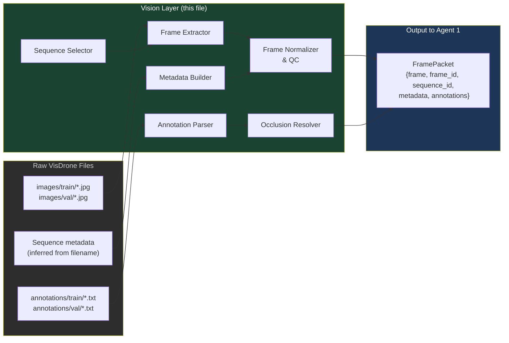
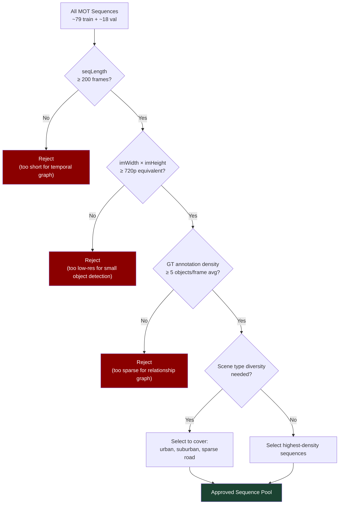
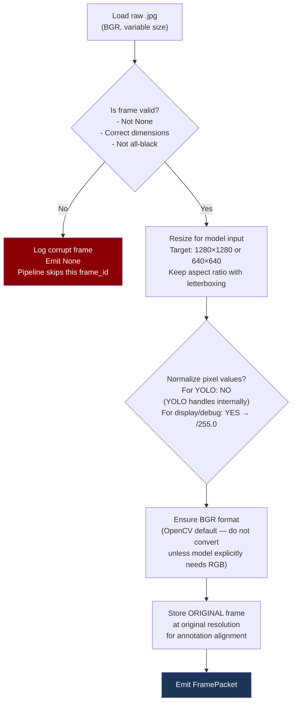
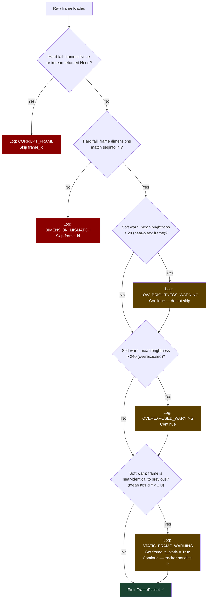
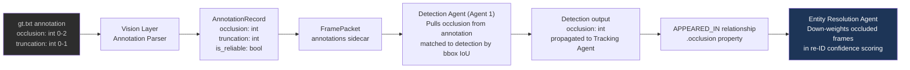
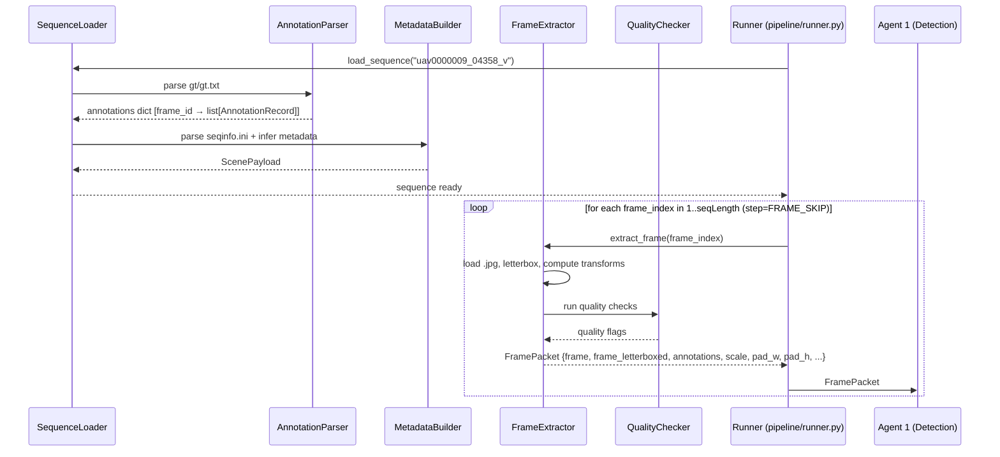

# vision.md — Raw Data Collection & Preprocessing Specification

> Upstream companion to `relationships.md` and `AGENTS.md`.
> This document specifies everything that must happen **before** Agent 1 (Detection Agent)
> receives a frame. Its output — a clean, normalized frame stream with validated metadata —
> is the only valid input to the detection pipeline.
> Written for coding agents. Do not implement data loading without reading this file first.

---

## Table of Contents

1. [Role of This Layer](#1-role-of-this-layer)
2. [VisDrone Dataset Structure](#2-visdrone-dataset-structure)
3. [Annotation Format & Parsing](#3-annotation-format--parsing)
4. [Sequence Selection & Filtering](#4-sequence-selection--filtering)
5. [Frame Extraction Pipeline](#5-frame-extraction-pipeline)
6. [Metadata Extraction & Scene Node Population](#6-metadata-extraction--scene-node-population)
7. [Frame Normalization & Quality Control](#7-frame-normalization--quality-control)
8. [Occlusion & Truncation Flags](#8-occlusion--truncation-flags)
9. [The Output Contract](#9-the-output-contract)
10. [Data Flow Architecture](#10-data-flow-architecture)
11. [Offline vs. Live Mode](#11-offline-vs-live-mode)
12. [Storage Layout](#12-storage-layout)
13. [Validation Checklist Before Pipeline Handoff](#13-validation-checklist-before-pipeline-handoff)

---

## 1. Role of This Layer

The vision layer sits at the very beginning of the pipeline. Its job is to take VisDrone's raw files — `.jpg` images, `.txt` annotation files, and sequence-level metadata — and produce a clean, frame-by-frame data stream that Agent 1 can consume without any additional parsing.



**What this layer does NOT do:**
- Run any neural network or model inference
- Write anything to Neo4j
- Make any decisions about objects or relationships
- Buffer or batch frames (that is the pipeline runner's job)

**What Agent 1 expects as input** (from `AGENTS.md`):
```python
{
  "frame": np.ndarray,       # HxWx3, BGR, uint8
  "frame_id": int,           # zero-indexed within sequence
  "sequence_id": str         # e.g., "uav0000009"
}
```

Everything in this document is about reliably producing exactly that, plus an accompanying annotation sidecar that the Detection Agent can optionally use for ground-truth occlusion labels.

---

## 2. VisDrone Dataset Structure

### Download

VisDrone auto-downloads through Ultralytics when training with `VisDrone.yaml`. For manual or custom ingestion (needed here), download directly:

```
Task 1 — Object Detection in Images:
  VisDrone2019-DET-train.zip   (~1.4 GB)  6471 images
  VisDrone2019-DET-val.zip     (~0.4 GB)   548 images
  VisDrone2019-DET-test-dev.zip (~0.8 GB) 1610 images

Task 4 — Multi-Object Tracking:
  VisDrone2019-MOT-train.zip   (video sequences with per-frame annotations)
  VisDrone2019-MOT-val.zip
```

For this project, **use Task 4 (MOT) sequences** as the primary data source. Task 1 gives you static images — useful for detection validation, but the graph pipeline requires temporal sequences. Task 1 can be used for model fine-tuning only.

### On-Disk Layout After Download

```
data/visdrone/
│
├── VisDrone2019-MOT-train/
│   └── sequences/
│       ├── uav0000009_04358_v/
│       │   ├── img1/                  # frames as %07d.jpg
│       │   │   ├── 0000001.jpg
│       │   │   ├── 0000002.jpg
│       │   │   └── ...
│       │   ├── gt/
│       │   │   └── gt.txt             # ground truth annotations
│       │   └── seqinfo.ini            # sequence metadata
│       ├── uav0000013_00000_v/
│       └── ...
│
├── VisDrone2019-MOT-val/
│   └── sequences/
│       └── ...
│
└── VisDrone2019-DET-train/            # static images (fine-tuning only)
    ├── images/
    └── annotations/
```

### seqinfo.ini Format

Every MOT sequence has a `seqinfo.ini` file. This is the **primary source of Scene metadata**:

```ini
[Sequence]
name=uav0000009_04358_v
imDir=img1
frameRate=30
seqLength=484
imWidth=1360
imHeight=765
imExt=.jpg
```

The vision layer must parse this file for every sequence and use it to construct the `Scene` node payload. Note: VisDrone's `seqinfo.ini` does NOT include altitude, weather, or scene type — these must be inferred or supplemented (see Section 6).

---

## 3. Annotation Format & Parsing

### VisDrone MOT Annotation Format (`gt/gt.txt`)

Each line is one detection in one frame:

```
<frame_index>,<target_id>,<bbox_left>,<bbox_top>,<bbox_width>,<bbox_height>,<score>,<object_category>,<truncation>,<occlusion>
```

**Example:**
```
1,1,684,444,16,33,1,1,0,0
1,2,744,430,17,35,1,1,0,0
2,1,683,445,16,33,1,1,0,0
```

### Field Definitions

| Field | Type | Description |
|---|---|---|
| `frame_index` | int | 1-indexed frame number |
| `target_id` | int | Ground truth object ID (persistent across frames — this is the GT track) |
| `bbox_left` | int | Left pixel coordinate of bbox |
| `bbox_top` | int | Top pixel coordinate of bbox |
| `bbox_width` | int | Width in pixels |
| `bbox_height` | int | Height in pixels |
| `score` | int | Always 1 in gt.txt (confidence placeholder) |
| `object_category` | int | Class ID (see table below) |
| `truncation` | int | 0=not truncated, 1=truncated (partially outside frame) |
| `occlusion` | int | 0=none, 1=partial (>0%, ≤50% occluded), 2=heavy (>50% occluded) |

### Class ID Mapping

| Category ID | Class Name | Class Group |
|---|---|---|
| 0 | ignored region | — (skip) |
| 1 | pedestrian | VulnerableRoadUser |
| 2 | people | VulnerableRoadUser |
| 3 | bicycle | VulnerableRoadUser |
| 4 | car | MotorVehicle |
| 5 | van | MotorVehicle |
| 6 | truck | MotorVehicle |
| 7 | tricycle | VulnerableRoadUser |
| 8 | awning-tricycle | VulnerableRoadUser |
| 9 | bus | MotorVehicle |
| 10 | motor | VulnerableRoadUser |
| 11 | others | — (skip) |

**Critical parsing rules:**
- Skip all rows where `object_category == 0` (ignored regions — these are areas annotators explicitly flagged as unreliable)
- Skip all rows where `object_category == 11` (others — too ambiguous for graph typing)
- Skip all rows where `score == 0` — some VisDrone annotation files use score=0 to mark distractor objects
- Convert `frame_index` from 1-indexed to 0-indexed: `frame_id = frame_index - 1`
- Convert bbox from `[left, top, width, height]` to `[x1, y1, x2, y2]`: `x2 = left + width`, `y2 = top + height`

### Annotation Parser Output

The parser must produce a lookup structure indexed by `frame_id` for O(1) access during frame streaming:

```python
# Type: dict[frame_id: int, list[AnnotationRecord]]
AnnotationRecord = {
    "gt_track_id": int,           # ground truth identity (for eval only, NOT used as track_id in graph)
    "bbox": [x1, y1, x2, y2],    # pixel coords, absolute
    "class_id": int,              # 1–10, already filtered
    "class_name": str,            # mapped from class_id
    "class_group": str,           # "VulnerableRoadUser" | "MotorVehicle"
    "truncation": int,            # 0 or 1
    "occlusion": int,             # 0, 1, or 2
    "is_reliable": bool           # False if truncation==1 AND occlusion==2
}

annotations: dict[int, list[AnnotationRecord]]
# annotations[42] → all AnnotationRecords for frame 42
```

**Important:** `gt_track_id` is the ground truth identity and is used **only for evaluation** (to compute MOTA/MOTP). It must never be passed to the graph or used as a substitute for ByteTrack's `track_id`. The two identity systems are completely separate.

---

## 4. Sequence Selection & Filtering

Not all VisDrone sequences are equally useful. The vision layer is responsible for selecting sequences that will maximize graph quality.

### Selection Criteria



### Recommended Starting Sequences (Val Split — Ground Truth Available)

Start with validation sequences because they have clean ground truth annotations for evaluating detection and tracking quality.

| Sequence ID | Frames | Resolution | Scene Type | Avg Objects/Frame | Priority |
|---|---|---|---|---|---|
| `uav0000009_04358_v` | 484 | 1360×765 | Urban road | ~15 | ✅ Start here |
| `uav0000013_00000_v` | 374 | 1360×765 | Suburban | ~8 | ✅ |
| `uav0000073_00000_v` | 415 | 1360×765 | Urban dense | ~22 | ✅ |
| `uav0000119_02301_v` | 265 | 1360×765 | Sparse road | ~5 | ⚠️ Low density |
| `uav0000149_00000_v` | 320 | 1360×765 | Intersection | ~18 | ✅ High event rate |

**For development:** Use `uav0000009` and `uav0000149` only. The former is a good baseline (moderate density, clear road), the latter has intersection dynamics which generate more NEAR_MISS and JAYWALKING events.

### Sequence Config File

Approved sequences are declared in `data/sequences.json`. The vision layer reads this file — never hardcodes sequence lists:

```json
{
  "sequences": [
    {
      "sequence_id": "uav0000009_04358_v",
      "split": "val",
      "priority": "primary",
      "use_for": ["graph", "eval"]
    },
    {
      "sequence_id": "uav0000149_00000_v",
      "split": "val",
      "priority": "primary",
      "use_for": ["graph", "eval"]
    },
    {
      "sequence_id": "uav0000073_00000_v",
      "split": "val",
      "priority": "secondary",
      "use_for": ["graph"]
    }
  ],
  "det_sequences": [
    {
      "sequence_id": "VisDrone2019-DET-train",
      "use_for": ["finetune"]
    }
  ]
}
```

---

## 5. Frame Extraction Pipeline

### Frame Loading

Frames are pre-stored as individual `.jpg` files in `img1/` — no video decoding needed. Load with OpenCV:

```
frame = cv2.imread(f"{sequence_dir}/img1/{frame_index:07d}.jpg")
# frame_index is 1-indexed in filenames; convert to 0-indexed frame_id internally
frame_id = frame_index - 1
```

### Frame Processing Steps (in order)



### Letterbox Resizing

YOLO requires square input. Resize without distortion using letterboxing — pad with grey (114, 114, 114):

```
Given original frame: W_orig × H_orig
Target size: IMG_SIZE (640 or 1280)

scale = min(IMG_SIZE / W_orig, IMG_SIZE / H_orig)
new_w = int(W_orig * scale)
new_h = int(H_orig * scale)

pad_w = (IMG_SIZE - new_w) / 2
pad_h = (IMG_SIZE - new_h) / 2

resized = cv2.resize(frame, (new_w, new_h))
letterboxed = cv2.copyMakeBorder(resized,
    top=int(pad_h), bottom=int(pad_h + 0.5),
    left=int(pad_w), right=int(pad_w + 0.5),
    borderType=cv2.BORDER_CONSTANT, value=(114, 114, 114))
```

**Critical:** Store `scale`, `pad_w`, and `pad_h` in the FramePacket. They are needed to project YOLO's output bounding boxes back to original pixel coordinates, which is required for annotation alignment and correct centroid computation.

### Frame ID Convention

| Context | Indexing | Notes |
|---|---|---|
| VisDrone filenames (`img1/`) | 1-indexed (`0000001.jpg`) | Convert immediately on load |
| VisDrone annotation `frame_index` | 1-indexed | Convert immediately on parse |
| Internal `frame_id` everywhere | 0-indexed | Single source of truth |
| Neo4j `Frame` node `frame_id` | 0-indexed | Matches internal |
| APPEARED_IN relationship `frame_id` | 0-indexed | Matches internal |

**Rule:** Convert to 0-indexed at the point of ingestion. Never use 1-indexed values past the loader.

### Frame Skipping (Temporal Subsampling)

For development and debugging, support a `FRAME_SKIP` parameter that processes every Nth frame:

```
FRAME_SKIP = 1    # process every frame (default, production)
FRAME_SKIP = 3    # process every 3rd frame (fast debug mode, ~10fps effective)
FRAME_SKIP = 6    # process every 6th frame (very fast, ~5fps)
```

When `FRAME_SKIP > 1`, the Frame nodes still use their original `frame_id` values (not re-indexed). The `PRECEDES` chain will have gaps — this is acceptable. The motion/speed computations in Agent 3 must account for the actual frame delta:

```python
speed = displacement / FRAME_SKIP   # not just displacement / 1
```

Store `FRAME_SKIP` in the FramePacket metadata so Agent 3 can use the correct delta.

---

## 6. Metadata Extraction & Scene Node Population

Every sequence must produce a `Scene` node payload. This section defines where each Scene property comes from.

### Properties That Come Directly From `seqinfo.ini`

| Scene Property | Source Field | Notes |
|---|---|---|
| `sequence_id` | `name` | Strip trailing `_v` if present |
| `total_frames` | `seqLength` | |
| `frame_rate` | `frameRate` | Store as int |
| `frame_width` | `imWidth` | Original resolution |
| `frame_height` | `imHeight` | Original resolution |

### Properties That Must Be Inferred

VisDrone's `seqinfo.ini` does not include altitude, weather, or scene type. These must be inferred from other sources in order of preference:

#### Altitude (`altitude_m`)

**Method 1 — VisDrone paper lookup table (preferred):**
The VisDrone dataset paper and supplementary materials provide per-sequence altitude ranges. A lookup table is provided in `data/visdrone_sequence_meta.json` (pre-populated from the paper). Values are approximate ranges — store the midpoint:

```json
{
  "uav0000009_04358_v": {"altitude_m": 45, "altitude_range": [40, 50]},
  "uav0000013_00000_v": {"altitude_m": 60, "altitude_range": [55, 65]},
  "uav0000073_00000_v": {"altitude_m": 35, "altitude_range": [30, 40]},
  "uav0000149_00000_v": {"altitude_m": 50, "altitude_range": [45, 55]}
}
```

**Method 2 — Apparent object size heuristic (fallback):**
If a sequence is not in the lookup table, estimate altitude from the median bounding box height of detected pedestrians:

```
For a typical adult (height ~1.7m), apparent pixel height at altitude Z:
  bbox_height_px = (focal_length_px * 1.7) / Z
  → Z ≈ (focal_length_px * 1.7) / median_pedestrian_bbox_height_px

VisDrone camera approximate focal length: 1500 px (estimated from dataset)
```

Store `altitude_source: "lookup"` or `altitude_source: "estimated"` on the Scene node.

#### Weather (`weather`)

**Method — Visual scene classifier:**
Run a lightweight classifier (ResNet-18 fine-tuned on weather classes, or a zero-shot CLIP query) on the first frame of each sequence to predict weather:

```
Classes: "clear", "overcast", "foggy", "rainy", "low_light"
```

If no classifier is available, default to `"clear"` and set `weather_source: "default"`.

Zero-shot CLIP approach (no fine-tuning needed):
```
Prompt templates:
  "A drone photo taken in clear sunny weather"
  "A drone photo taken under heavy cloud cover"
  "A drone photo taken in foggy or hazy conditions"
  "A drone photo taken in rain"
  "A drone photo taken at dusk or night"

→ Take the highest-scoring template's label
```

#### Scene Type (`scene_type`)

**Method — Zone density analysis on first 30 frames:**
```
vehicle_density = avg vehicles per frame in first 30 frames
pedestrian_density = avg pedestrians per frame

if vehicle_density > 10 AND pedestrian_density > 5:
    scene_type = "urban_dense"
elif vehicle_density > 5:
    scene_type = "urban"
elif vehicle_density > 2:
    scene_type = "suburban"
else:
    scene_type = "rural"
```

#### Time of Day (`time_of_day`)

**Method — Mean frame brightness:**
```python
mean_brightness = np.mean(cv2.cvtColor(frame, cv2.COLOR_BGR2GRAY))

if mean_brightness < 60:
    time_of_day = "nighttime"
elif mean_brightness < 120:
    time_of_day = "dusk_dawn"
else:
    time_of_day = "daytime"
```

Compute over the first 10 frames and take the majority vote.

### Complete Scene Node Payload

The vision layer must produce this dict before the sequence begins processing:

```python
ScenePayload = {
    "sequence_id": str,           # e.g., "uav0000009_04358_v"
    "total_frames": int,
    "frame_rate": int,
    "frame_width": int,           # original resolution
    "frame_height": int,
    "altitude_m": float,
    "altitude_source": str,       # "lookup" | "estimated"
    "weather": str,               # "clear" | "overcast" | "foggy" | "rainy" | "low_light"
    "weather_source": str,        # "classifier" | "clip" | "default"
    "scene_type": str,            # "urban_dense" | "urban" | "suburban" | "rural"
    "time_of_day": str,           # "daytime" | "dusk_dawn" | "nighttime"
    "split": str,                 # "train" | "val" | "test"
    "frame_skip": int,            # actual FRAME_SKIP used
    "annotation_available": bool  # True if gt.txt exists
}
```

This payload is written to Neo4j by the Graph Agent as a `Scene` node before the first frame is processed. The vision layer hands it off via `pipeline/runner.py`.

---

## 7. Frame Normalization & Quality Control

### Per-Frame Quality Checks

Before emitting a FramePacket, the vision layer runs these checks in order. If any hard-fail check fails, the frame is skipped and logged:



### Quality Metadata on FramePacket

These QC flags travel with the frame and are stored on the `APPEARED_IN` relationship's `occlusion` field is set by annotation, but the frame-level quality flags are stored on the `Frame` node:

```python
Frame node additional properties (set by Graph Agent based on vision layer output):
  is_static: bool       # from STATIC_FRAME_WARNING
  brightness: float     # mean pixel brightness
  quality_flags: list   # list of warning strings, empty if clean
```

### Frame Delta Tracking (for motion continuity)

The vision layer maintains a `prev_frame_gray` buffer (grayscale of the previous emitted frame) to compute the mean absolute difference check above. This buffer lives in the `SequenceLoader` class, not in Agent 3 — it is a data-quality concern, not a motion computation.

---

## 8. Occlusion & Truncation Flags

The occlusion and truncation values from VisDrone annotations are the most valuable quality signals in the dataset. They must be handled carefully because they directly affect graph reliability.

### Occlusion Levels

| Value | Meaning | Impact on Graph |
|---|---|---|
| 0 | No occlusion | Full confidence. Use detection normally. |
| 1 | Partial occlusion (≤50% of object hidden) | Moderate confidence. Speed/heading still reliable. |
| 2 | Heavy occlusion (>50% hidden) | Low confidence. Mark trajectory waypoint as unreliable. ByteTrack may lose track here. |

### Truncation Levels

| Value | Meaning | Impact on Graph |
|---|---|---|
| 0 | Not truncated | Use normally. |
| 1 | Truncated (partially outside frame boundary) | Centroid is unreliable — the visible portion may not represent true center. Mark as truncated in AnnotationRecord. |

### Reliability Flag

An annotation is marked `is_reliable = False` when:
```
truncation == 1 AND occlusion == 2
```

Both conditions together mean the object is both cut off by the frame boundary AND mostly hidden — the detection geometry is essentially meaningless.

### How Occlusion Flows Through the Pipeline



### Matching Annotations to YOLO Detections

When running on annotated data (val/test), the Detection Agent can enrich each YOLO detection with its ground truth occlusion label. The match is done by IoU:

```
For each YOLO detection D:
  For each annotation A in the same frame:
    iou = compute_iou(D.bbox, A.bbox)
    if iou > 0.5:
      D.occlusion = A.occlusion
      D.gt_track_id = A.gt_track_id   (for eval only)
      break
  else:
    D.occlusion = 0   (default: assume no occlusion if unmatched)
```

**When running on unannotated data (train sequences without GT):** Set `occlusion = 0` for all detections. The occlusion field still exists but carries no annotation-backed value.

---

## 9. The Output Contract

The vision layer's final output to the pipeline is the **FramePacket**. This is the strict interface contract. Agent 1 must receive exactly this structure and nothing else.

```python
FramePacket = {
    # === Core frame data ===
    "frame": np.ndarray,               # HxWx3, BGR, uint8, ORIGINAL resolution
    "frame_letterboxed": np.ndarray,   # IMG_SIZE x IMG_SIZE, BGR, uint8 — model input
    "frame_id": int,                   # 0-indexed, within sequence

    # === Spatial transform params (for bbox reprojection) ===
    "scale": float,                    # resize scale factor applied
    "pad_w": float,                    # horizontal letterbox padding (pixels)
    "pad_h": float,                    # vertical letterbox padding (pixels)
    "orig_width": int,                 # frame_width from seqinfo.ini
    "orig_height": int,                # frame_height from seqinfo.ini

    # === Sequence context ===
    "sequence_id": str,
    "frame_skip": int,                 # actual frame skip in use
    "is_static": bool,                 # from QC check

    # === Annotation sidecar (None if not available) ===
    "annotations": list[AnnotationRecord] | None,
    # list of AnnotationRecords for this frame_id (0-indexed)
    # None if gt.txt not available for this sequence/split

    # === Scene payload (included only on frame_id == 0) ===
    "scene_payload": ScenePayload | None
    # ScenePayload dict (defined in Section 6) on first frame only
    # None for all subsequent frames — Graph Agent caches it
}
```

### Why `frame` AND `frame_letterboxed`?

- `frame_letterboxed` is passed to YOLO for inference. YOLO returns bboxes in letterboxed coordinates.
- YOLO's bbox coordinates must be projected back to original image space using `scale`, `pad_w`, `pad_h`.
- `frame` at original resolution is kept for annotation alignment (IoU matching uses original coords).
- After Agent 1 finishes, only the detection dicts (with reprojected original-space bboxes) move forward. Neither frame array is passed to Neo4j.

### Bbox Coordinate Reprojection (Agent 1's responsibility, but specified here)

YOLO returns bboxes in letterboxed space. Agent 1 must convert to original pixel space before emitting detections:

```
x1_orig = (x1_letterboxed - pad_w) / scale
y1_orig = (y1_letterboxed - pad_h) / scale
x2_orig = (x2_letterboxed - pad_w) / scale
y2_orig = (y2_letterboxed - pad_h) / scale

# Clamp to frame boundaries:
x1_orig = max(0, min(x1_orig, orig_width))
y1_orig = max(0, min(y1_orig, orig_height))
x2_orig = max(0, min(x2_orig, orig_width))
y2_orig = max(0, min(y2_orig, orig_height))
```

All downstream agents (Motion Agent, Graph Agent) work in original pixel space. Centroid normalization in Agent 3 divides by `orig_width` and `orig_height`.

---

## 10. Data Flow Architecture

### Complete Vision Layer → Pipeline Flow



### SequenceLoader Class Interface

```python
class SequenceLoader:
    def __init__(self, sequence_id: str, config: dict):
        # Loads seqinfo.ini, gt.txt, builds annotation index, computes scene metadata
        ...

    def get_scene_payload(self) -> ScenePayload:
        # Returns the Scene node dict, ready for Neo4j write
        ...

    def iter_frames(self, frame_skip: int = 1) -> Generator[FramePacket, None, None]:
        # Yields FramePackets in order
        # Handles: frame loading, letterboxing, QC, annotation attachment, scene payload on frame 0
        ...

    def get_annotation(self, frame_id: int) -> list[AnnotationRecord]:
        # O(1) lookup into pre-parsed annotation index
        ...

    @staticmethod
    def list_available(sequences_json_path: str) -> list[str]:
        # Reads data/sequences.json and returns approved sequence_ids
        ...
```

---

## 11. Offline vs. Live Mode

The vision layer supports two modes. The pipeline runner selects the mode via config.

### Mode 1: Offline (Default — VisDrone files on disk)

This is the primary mode for this project. The SequenceLoader reads pre-recorded `.jpg` files.

```
configs/detection.yaml:
  vision_mode: offline
  data_root: data/visdrone/VisDrone2019-MOT-val/sequences
  frame_skip: 1
  img_size: 1280
```

### Mode 2: Live Simulation (for demo purposes)

Replays a VisDrone sequence at real-time speed by throttling the frame emission rate to match the original `frameRate` from `seqinfo.ini`. No actual live camera is involved — this just simulates real-time behavior for a demo:

```python
# In iter_frames, add a sleep between frames:
time.sleep(1.0 / (frame_rate / frame_skip))
```

This mode is useful for a live-running Streamlit demo that shows objects moving and relationships forming in real time in the Neo4j browser.

### Mode 3: True Live (Future Extension — not implemented now)

For a true live camera feed (USB webcam, RTSP drone stream), replace the SequenceLoader with a `LiveFrameSource` class that:
- Reads from `cv2.VideoCapture(rtsp_url)` or `cv2.VideoCapture(0)` for webcam
- Has no annotation sidecar (set `annotations = None`)
- Has no ground truth scene metadata (use defaults + inference)
- Assigns `frame_id` as a monotonically increasing counter from startup

The FramePacket format is identical — the rest of the pipeline does not change.

---

## 12. Storage Layout

### Where Files Live

```
data/
│
├── visdrone/
│   ├── VisDrone2019-MOT-val/
│   │   └── sequences/
│   │       ├── uav0000009_04358_v/
│   │       │   ├── img1/              # source frames (read-only)
│   │       │   ├── gt/
│   │       │   │   └── gt.txt         # source annotations (read-only)
│   │       │   └── seqinfo.ini        # source metadata (read-only)
│   │       └── uav0000149_00000_v/
│   │           └── ...
│   │
│   └── VisDrone2019-DET-train/        # for YOLO fine-tuning only
│       ├── images/
│       └── annotations/
│
├── sequences.json                     # approved sequence list
│
└── visdrone_sequence_meta.json        # altitude + supplementary metadata lookup
    # Format:
    # {
    #   "uav0000009_04358_v": {
    #     "altitude_m": 45,
    #     "altitude_range": [40, 50],
    #     "notes": "urban road, moderate density"
    #   },
    #   ...
    # }
```

### What the Vision Layer Writes (Logs Only)

The vision layer writes nothing to Neo4j. It only writes to `logs/`:

```
logs/
├── vision_skipped_frames.jsonl     # corrupt or dimension-mismatch frames
│   # {"sequence_id": str, "frame_id": int, "reason": str, "timestamp": str}
│
├── vision_quality_warnings.jsonl   # soft QC warnings (low brightness, static, etc.)
│   # {"sequence_id": str, "frame_id": int, "warning": str}
│
└── vision_scene_metadata.jsonl     # final ScenePayload for each processed sequence
    # {"sequence_id": str, "scene_payload": ScenePayload, "timestamp": str}
    # useful for auditing inferred values like weather and altitude
```

---

## 13. Validation Checklist Before Pipeline Handoff

Run these checks before starting any sequence. If any hard-fail item fails, abort and fix before running the full pipeline:

### Environment Checks
- [ ] `data/visdrone/` exists and is populated (run `python pipeline/sequence_loader.py --check`)
- [ ] `data/sequences.json` exists and lists at least one sequence
- [ ] `data/visdrone_sequence_meta.json` exists (altitude lookup table)
- [ ] OpenCV (`cv2`) and NumPy available and import cleanly
- [ ] Target sequences have both `img1/` and `gt/gt.txt` present

### Per-Sequence Checks (run at load time)
- [ ] `seqinfo.ini` parses without error — `seqLength`, `imWidth`, `imHeight`, `frameRate` all present
- [ ] `gt.txt` row count matches expected detections (do a sanity check: `wc -l gt.txt` should be > `seqLength * 3`)
- [ ] First frame loads correctly (`cv2.imread` returns non-None)
- [ ] Frame dimensions match `imWidth × imHeight` from `seqinfo.ini`
- [ ] Annotation parser produces at least 1 record for frame_id 0

### Output Contract Checks (run on first 5 FramePackets)
- [ ] `frame.dtype == np.uint8` and `frame.shape == (orig_height, orig_width, 3)`
- [ ] `frame_letterboxed.shape == (IMG_SIZE, IMG_SIZE, 3)`
- [ ] `scale > 0` and `pad_w >= 0` and `pad_h >= 0`
- [ ] `frame_id` is 0-indexed (first packet has `frame_id == 0`)
- [ ] `annotations` is a list (possibly empty) or `None` — never raises KeyError
- [ ] `scene_payload` is present on `frame_id == 0` and `None` on all others
- [ ] Reprojection check: apply scale/pad back to a known annotation bbox and verify it matches original coords within 2px

### Metadata Checks
- [ ] `ScenePayload` has all required fields (see Section 6)
- [ ] `altitude_m > 0`
- [ ] `weather` is one of the 5 valid values
- [ ] `scene_type` is one of the 4 valid values
- [ ] `time_of_day` is one of the 3 valid values
- [ ] `annotation_available` is `True` for val/test sequences
